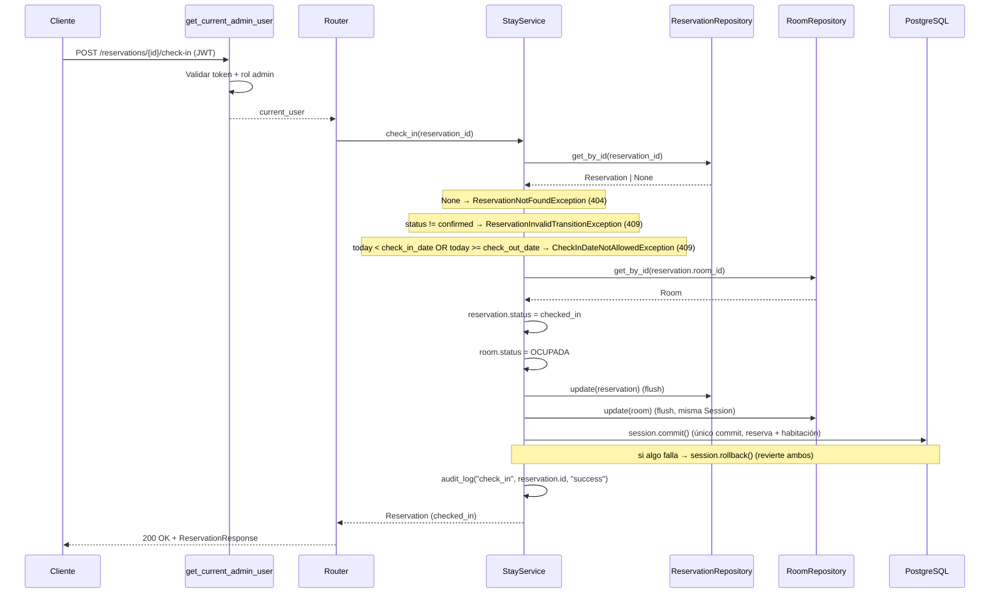

# Design Document: Check-in / Check-out Management

## Overview

El módulo de check-in / check-out gestiona el ciclo de vida operativo de una reserva existente. Extiende el enum `ReservationStatus` con `checked_in` y `checked_out`, define las transiciones válidas y coordina, de forma atómica, el cambio de estado de la reserva junto con el cambio del estado operativo de la habitación asociada.

El diseño reutiliza la arquitectura por capas y las convenciones ya establecidas por Room, Guest y Reservation Management:

- **API Layer** (FastAPI Router) → Recibe HTTP, valida el id, delega al Service.
- **Service Layer** → Aplica reglas de transición, valida fecha de check-in, coordina reserva + habitación en una sola transacción.
- **Repository Layer** → Reutiliza `ReservationRepository` y `RoomRepository` existentes.
- **Core Layer** → Configuración, excepciones, logging y autenticación (reutilizados).

### Alcance de cambios sobre módulos existentes

Este módulo **modifica** dos artefactos existentes (cambios documentados y acotados, no rediseño):

1. `app/models/reservation.py` → añadir `CHECKED_IN` y `CHECKED_OUT` al enum `ReservationStatus`.
2. `app/repositories/reservation_repository.py` → `get_active_overlapping` pasa a considerar activas las reservas `confirmed` **y** `checked_in`.

Y **añade**: una migración Alembic (amplía el CHECK de `reservations.status`), excepciones de dominio, un `StayService`, un router de endpoints dedicados, y su registro en `main.py`.

### Decisiones de Diseño Clave

| Decisión | Elección | Justificación |
|----------|----------|---------------|
| Nuevos estados | `checked_in`, `checked_out` en el enum existente | Req 1; no se renombran ni eliminan los actuales |
| Estados de habitación | Reutiliza `RoomStatus.OCUPADA` / `RoomStatus.DISPONIBLE` | Req 2.2, 4.2; no se inventan estados nuevos |
| Endpoints | `POST /{id}/check-in`, `POST /{id}/check-out` | Req 7.1, 7.2; consistente con `/cancel` |
| Edición de status vía PATCH | No permitida (PATCH solo toca room_id/fechas) | Req 7.3; el PATCH actual ya no expone `status` |
| Transacción reserva+habitación | Única sesión SQLAlchemy por request; ambos `flush`, un solo commit | Req 5; sin transacciones distribuidas |
| Fecha local del hotel | Inyectada por un proveedor `today()` en el service (default: fecha local del sistema) | Req 3.4; determinismo y testeabilidad |
| Solapamiento | `confirmed` + `checked_in` activos | Req 6 |
| Manejo de errores | `AppException` + handlers globales | Req 9.2 |
| Auditoría | `audit_log` existente, operaciones `check_in`/`check_out` | Req 11 |
| Nombre del componente | `StayService` (ciclo de vida de la estancia) | Evita solapar responsabilidades con `ReservationService` (CRUD) |

## Architecture

### Diagrama de Componentes

```mermaid
graph TD
    Client[Cliente HTTP] --> Auth[get_current_admin_user<br>Dependency existente]
    Auth --> Router[API Router<br>/api/v1/reservations/.../check-in|check-out]
    Router --> Service[StayService]
    Service --> ResRepo[ReservationRepository<br>reutilizado]
    Service --> RoomRepo[RoomRepository<br>reutilizado]
    ResRepo --> DB[(PostgreSQL)]
    RoomRepo --> DB
    Service --> Logger[audit_log]

    subgraph Core (reutilizado)
        Exceptions[AppException + subclases]
        Logger
        Auth
    end
```

### Diagrama de Secuencia — Check-in



### Transacción y consistencia (Req 5)

**Verificación del ciclo de vida de sesión existente (código real inspeccionado):**

- `app/db/session.py`: `SessionLocal = sessionmaker(autocommit=False, autoflush=False, bind=engine)`. La dependencia `get_db` hace `yield db` y en `finally` solo llama `db.close()`. **No hace `commit` ni `rollback`.**
- `ReservationRepository.update` y `RoomRepository.update`: ambos reciben la `Session` inyectada en el constructor y solo llaman `self.db.flush()` + `self.db.refresh()`. **Ninguno hace `commit` ni `rollback` de forma independiente.** (Ambos comparten la misma `Session` cuando se construyen con el mismo `db`.)

**Conclusión de la verificación:** el borde request/sesión **no** garantiza por sí mismo "un commit al terminar" ni "rollback ante fallo", como se asumió originalmente. `get_db` nunca hace commit; los servicios existentes (reservation/guest/room) se apoyan solo en `flush()`, y en producción el commit no ocurre en el borde (los tests de integración funcionan porque su override de `get_db` añade `db.commit()`). Por lo tanto, para este módulo **no** se puede depender de un commit/rollback implícito en el borde del request.

**Lo que sí es cierto y se conserva:** ambos repositorios operan sobre **la misma `Session` inyectada** (vía `_get_stay_service`), por lo que las dos mutaciones (reserva y habitación) viven en la **misma transacción** de SQLAlchemy. Falta únicamente el punto de confirmación/reversión explícito.

**Cambio mínimo para garantizar atomicidad (sin rediseñar repositorios ni `get_db`):** el `StayService` posee el `commit`/`rollback` de su propia operación, usando la **misma `Session`** que ya comparten sus repositorios (la recibe explícitamente en el constructor). El patrón es:

```python
class StayService:
    def __init__(self, session, reservation_repository, room_repository,
                 today_provider=date.today):
        self.session = session               # misma Session inyectada a ambos repos
        self.reservation_repository = reservation_repository
        self.room_repository = room_repository
        self._today = today_provider

    def _commit_atomic(self, reservation, room, operation):
        try:
            self.reservation_repository.update(reservation)  # flush
            self.room_repository.update(room)                # flush (misma Session)
            self.session.commit()                            # un único commit
        except Exception:
            self.session.rollback()                          # revierte ambos cambios
            audit_log(operation, reservation.id, "failure")
            raise
        audit_log(operation, reservation.id, "success")
        return reservation
```

Y el `_get_stay_service` pasa la misma sesión al servicio y a los repositorios:

```python
def _get_stay_service(db: Session = Depends(get_db)) -> StayService:
    return StayService(
        session=db,
        reservation_repository=ReservationRepository(db),
        room_repository=RoomRepository(db),
    )
```

Propiedades que esto garantiza (Req 5):

- **Una transacción:** ambas actualizaciones ocurren sobre la misma `Session`/transacción.
- **Un commit:** un único `self.session.commit()` persiste reserva + habitación juntas.
- **Rollback ante fallo:** si cualquiera de los dos `update`/`flush` o el `commit` falla, `self.session.rollback()` revierte ambos cambios, evitando estado parcial o inconsistente.

**Restricciones respetadas:**

- No se modifica `get_db`, `SessionLocal` ni la firma/comportamiento de los repositorios (`update` sigue haciendo solo `flush`/`refresh`; el commit lo posee el servicio, no el repositorio).
- El commit/rollback vive en la capa de servicio (lógica de negocio/coordinación), no en el repositorio, coherente con la separación de capas existente.
- No se introducen transacciones distribuidas, colas ni bloqueos explícitos (Req 5.4). Si en el futuro se requiere protección ante concurrencia real, se podrá añadir `SELECT ... FOR UPDATE`; queda fuera del MVP.

> Nota de compatibilidad con tests: como el override de `get_db` en los tests de integración también hace `commit`, un `commit()` explícito del servicio seguido del `commit()` (no-op) del override es seguro. Para los tests unitarios/property que construyen el servicio con una `Session` de SQLite directa, el `commit` del servicio persiste en esa sesión de forma consistente.

> Nota de diseño: el orden de operaciones valida **todo** (existencia, transición, fecha) antes de mutar cualquier entidad. Las mutaciones de reserva y habitación ocurren al final, juntas, seguidas del commit atómico, minimizando la ventana de un fallo intermedio.

## Components and Interfaces

### 1. API Layer — `app/api/reservations.py` (extensión)

Se añaden dos endpoints al router existente de reservas, siguiendo el patrón de `/cancel`. Se añade un helper `_get_stay_service` (o se extiende el existente) que arma el `StayService` con los repositorios de reserva y habitación sobre la misma sesión.

```python
from app.services.stay_service import StayService


def _get_stay_service(db: Session = Depends(get_db)) -> StayService:
    return StayService(
        session=db,
        reservation_repository=ReservationRepository(db),
        room_repository=RoomRepository(db),
    )


@router.post("/{reservation_id}/check-in", response_model=ReservationResponse)
def check_in_reservation(
    reservation_id: int,
    current_user: dict = Depends(get_current_admin_user),
    service: StayService = Depends(_get_stay_service),
) -> ReservationResponse:
    """Registrar el check-in de una reserva confirmada."""
    reservation = service.check_in(reservation_id)
    return ReservationResponse.model_validate(reservation)


@router.post("/{reservation_id}/check-out", response_model=ReservationResponse)
def check_out_reservation(
    reservation_id: int,
    current_user: dict = Depends(get_current_admin_user),
    service: StayService = Depends(_get_stay_service),
) -> ReservationResponse:
    """Registrar el check-out de una reserva con check-in realizado."""
    reservation = service.check_out(reservation_id)
    return ReservationResponse.model_validate(reservation)
```

**Sobre el PATCH (Req 7.3):** el `ReservationUpdate` actual solo contiene `room_id`, `check_in_date`, `check_out_date` (con `extra="forbid"`), por lo que el endpoint PATCH **ya no permite** editar `status`. No se requiere cambio; el diseño solo documenta que las transiciones de estado se hacen exclusivamente por los endpoints dedicados y por la cancelación existente. Se recomienda un test que confirme que enviar `status` al PATCH devuelve 422 (garantizado por `extra="forbid"`).

### 2. Service Layer — `app/services/stay_service.py` (nuevo)

```python
from collections.abc import Callable
from datetime import date

from app.core.exceptions import (
    CheckInDateNotAllowedException,
    ReservationInvalidTransitionException,
    ReservationNotFoundException,
    RoomNotFoundException,
)
from app.core.logging import audit_log
from app.models.reservation import Reservation, ReservationStatus
from app.models.room import RoomStatus
from app.repositories.reservation_repository import ReservationRepository
from app.repositories.room_repository import RoomRepository


class StayService:
    """Gestiona el ciclo de vida operativo (check-in / check-out) de una reserva."""

    def __init__(
        self,
        session: Session,
        reservation_repository: ReservationRepository,
        room_repository: RoomRepository,
        today_provider: Callable[[], date] = date.today,
    ):
        # session es la MISMA Session inyectada a ambos repositorios; el servicio
        # posee el commit/rollback atómico de la operación (ver "Transacción y
        # consistencia"). Los repositorios solo hacen flush/refresh.
        self.session = session
        self.reservation_repository = reservation_repository
        self.room_repository = room_repository
        self._today = today_provider

    def check_in(self, reservation_id: int) -> Reservation:
        """
        Reglas:
        - La reserva debe existir (ReservationNotFoundException, 404)
        - status debe ser 'confirmed' (ReservationInvalidTransitionException, 409)
        - today >= check_in_date AND today < check_out_date
          (CheckInDateNotAllowedException, 409)
        - reservation.status -> checked_in ; room.status -> OCUPADA (misma transacción)
        - audit_log("check_in", reservation.id, result)
        """
        ...

    def check_out(self, reservation_id: int) -> Reservation:
        """
        Reglas:
        - La reserva debe existir (ReservationNotFoundException, 404)
        - status debe ser 'checked_in' (ReservationInvalidTransitionException, 409)
        - reservation.status -> checked_out ; room.status -> DISPONIBLE (misma transacción)
        - audit_log("check_out", reservation.id, result)
        """
        ...
```

**Regla de fecha (Req 3):** la fecha local del hotel se obtiene mediante `today_provider` (por defecto `date.today`). Esto hace la regla determinista y fácil de probar (los tests inyectan un proveedor con una fecha fija). El check-in es válido sii `check_in_date <= today < check_out_date`.

**Proveedor de fecha:** el default `date.today` cubre el MVP. La zona horaria del hotel se considera la del entorno de ejecución; si en el futuro se requiere una zona horaria explícita, se puede reemplazar el proveedor por uno basado en `settings` sin cambiar la lógica del service.

**Coordinación de estados:** el service obtiene la habitación con `room_repository.get_by_id(reservation.room_id)`. Si no existe (situación anómala por integridad referencial), lanza `RoomNotFoundException`. Tras validar todo, muta ambos objetos y llama `update` en cada repositorio (ambos `flush` sobre la misma sesión). El `audit_log` se invoca con el mismo patrón try/except de los otros services.

**Reglas de negocio (resumen):**

| Operación | Precondición estado | Acción reserva | Acción habitación | Errores |
|-----------|--------------------|-----------------|-------------------|---------|
| check_in | `confirmed` | → `checked_in` | → `OCUPADA` | 404 no existe; 409 estado inválido; 409 fecha no permitida |
| check_out | `checked_in` | → `checked_out` | → `DISPONIBLE` | 404 no existe; 409 estado inválido |

### 3. Repository Layer — reutilizado + un cambio acotado

- **`ReservationRepository`**: se reutiliza `get_by_id` y `update`. Se **modifica** `get_active_overlapping` para incluir estado `checked_in` además de `confirmed` (Req 6.3):

```python
from sqlalchemy import or_
...
.filter(
    or_(
        Reservation.status == ReservationStatus.CONFIRMED,
        Reservation.status == ReservationStatus.CHECKED_IN,
    )
)
```

Equivalente idiomático: `Reservation.status.in_([ReservationStatus.CONFIRMED, ReservationStatus.CHECKED_IN])`. La regla de intervalo semiabierto `[check_in_date, check_out_date)` no cambia.

- **`RoomRepository`**: se reutiliza `get_by_id` y `update` existentes, sin cambios.

### 4. Authentication Dependency — reutilizada

`get_current_admin_user` protege ambos endpoints (Req 10): 401 token faltante/inválido, 403 no-admin, continúa para admin válido. Sin middleware nuevo.

### 5. Custom Exceptions — `app/core/exceptions.py` (extensión)

Se añaden dos subclases de `AppException`. Se reutiliza `ReservationNotFoundException` (404) y `RoomNotFoundException` (404) ya existentes.

```python
class ReservationInvalidTransitionException(AppException):
    def __init__(self):
        super().__init__(
            detail="La transición de estado de la reserva no es válida",
            status_code=409,
        )


class CheckInDateNotAllowedException(AppException):
    def __init__(self, detail: str = "El check-in no está permitido en esta fecha"):
        super().__init__(detail=detail, status_code=409)
```

`CheckInDateNotAllowedException` admite un `detail` para diferenciar "antes de la fecha de entrada" vs "en o después de la fecha de salida" (Req 3.2, 3.3), manteniendo el status 409.

> Nota: se usa una excepción de transición genérica (409) para todos los casos de estado inválido (doble check-in, doble check-out, check-out sin check-in, check-in de cancelada, etc.), lo que satisface el Req 9.4 con un único tipo semántico.

### 6. Exception Handling — reutilizado

Sin esquema de error nuevo (Req 9.2). Los handlers globales existentes (`app_exception_handler`, `generic_exception_handler`) convierten las nuevas excepciones en JSON `{"detail", "status_code"}`. Solo se requiere que las nuevas excepciones hereden de `AppException` (ya cubiertas por el handler registrado). La validación de tipo del `reservation_id` (entero) produce 422 nativo de FastAPI (Req 7.4).

### 7. Audit Logger — `app/core/logging.py` (reutilizado)

Se reutiliza `audit_log(operation, room_id, result)` con el id de reserva posicional, igual que en los otros módulos (operaciones `"check_in"` y `"check_out"`). Nunca registra PII del huésped ni datos sensibles (Req 11). Se usa el mismo bloque try/except que registra `"failure"` si el logging falla, sin interrumpir el flujo.

## Data Models

### Cambio en `app/models/reservation.py`

```python
class ReservationStatus(str, enum.Enum):
    CONFIRMED = "confirmed"
    CHECKED_IN = "checked_in"
    CHECKED_OUT = "checked_out"
    CANCELLED = "cancelled"
```

No cambian las columnas de la tabla; solo el conjunto de valores del enum de estado. El modelo `Room` no cambia (se reutilizan `RoomStatus.OCUPADA` y `RoomStatus.DISPONIBLE`).

### Alembic Migration (nueva revisión)

La migración `003_create_reservations_table.py` creó la tabla con:

```
CheckConstraint("status IN ('confirmed', 'cancelled')", name="ck_reservations_status")
```

Se requiere una **nueva revisión** (por ejemplo `004_extend_reservation_status.py`) con `down_revision = "003"` que amplíe esa restricción:

- `upgrade()`: eliminar el check `ck_reservations_status` y recrearlo como
  `status IN ('confirmed', 'checked_in', 'checked_out', 'cancelled')`.
- `downgrade()`: restaurar el check original `status IN ('confirmed', 'cancelled')`.

Consideraciones:

- En PostgreSQL, `op.drop_constraint("ck_reservations_status", "reservations", type_="check")` seguido de `op.create_check_constraint(...)` con el nuevo predicado.
- SQLite (usado en algunos tests con `create_all`) no aplica esta migración porque las tablas se crean desde el metadata del modelo; el enum extendido del modelo cubre esos casos. La migración es la vía de verdad para PostgreSQL.
- Confirmar el head real de Alembic antes de fijar `down_revision` (actualmente `003`).

## Error Handling

### Mapeo de Errores

| Condición | Excepción | HTTP |
|-----------|-----------|------|
| Reserva no encontrada | `ReservationNotFoundException` (reutilizada) | 404 |
| Habitación asociada no encontrada (anómalo) | `RoomNotFoundException` (reutilizada) | 404 |
| Transición inválida (estado incorrecto, doble check-in/out) | `ReservationInvalidTransitionException` | 409 |
| Check-in fuera de la ventana de fechas | `CheckInDateNotAllowedException` | 409 |
| id con formato inválido | `ValidationError` (FastAPI) | 422 |
| Token faltante/ inválido | `HTTPException` (auth existente) | 401 |
| Sin rol admin | `HTTPException` (auth existente) | 403 |
| Error de BD / no controlado | `Exception` (catch-all) | 500 |

### Formato de respuesta de error (reutilizado)

```json
{ "detail": "La transición de estado de la reserva no es válida", "status_code": 409 }
```

## Correctness Properties

- **P1 — Check-in válido:** dado `confirmed` y `check_in_date <= today < check_out_date`, tras check-in la reserva queda `checked_in` y la habitación `ocupada`. (Req 2, 3.1)
- **P2 — Check-in temprano rechazado:** si `today < check_in_date`, se rechaza con 409 y no cambian ni la reserva ni la habitación. (Req 3.2)
- **P3 — Check-in tardío rechazado:** si `today >= check_out_date`, se rechaza con 409 sin cambios. (Req 3.3)
- **P4 — Transiciones inválidas de check-in:** para cualquier estado inicial distinto de `confirmed` (`checked_in`, `checked_out`, `cancelled`), el check-in se rechaza con 409. (Req 2.4, transiciones inválidas)
- **P5 — Check-out válido:** dado `checked_in`, tras check-out la reserva queda `checked_out` y la habitación `disponible`, en cualquier fecha. (Req 4)
- **P6 — Transiciones inválidas de check-out:** para cualquier estado inicial distinto de `checked_in`, el check-out se rechaza con 409 (incluye doble check-out y check-out sin check-in). (Req 4.4)
- **P7 — Atomicidad:** si la operación falla tras mutar una entidad pero antes del commit, ni la reserva ni la habitación quedan modificadas de forma persistente. (Req 5.2)
- **P8 — Solapamiento con checked_in:** una reserva `checked_in` bloquea la creación de una reserva solapada para la misma habitación; una `checked_out`/`cancelled` no. (Req 6.1, 6.2)
- **P9 — Preservación:** check-in y check-out no modifican id, guest_id, room_id, fechas ni total_price; check-out no elimina la reserva. (Req 2.6, 4.7)
- **P10 — Auth:** sin JWT válido → 401; JWT válido no-admin → 403 en ambos endpoints. (Req 10)
- **P11 — Auditoría sin PII:** los eventos `check_in`/`check_out` registran solo operación, timestamp, id de reserva y resultado; nunca PII, tokens ni contraseñas. (Req 11)

## Testing Strategy

Se replica el enfoque dual (unit + property-based con Hypothesis) y la estructura de carpetas de los módulos existentes.

### Estructura de Tests

```
tests/
├── unit/
│   ├── test_stay_service.py          # Transiciones, regla de fecha, coordinación de estados (repos mockeados)
│   └── test_reservation_repository.py # (extensión) get_active_overlapping incluye checked_in
├── property/
│   └── test_stay_properties.py       # P1–P9 (service con SQLite en memoria)
└── integration/
    ├── test_stay_api.py              # Endpoints check-in/check-out + auth (200/404/409/422/401/403)
    └── test_stay_audit_logging.py    # P11 auditoría sin PII
```

### Casos y propiedades clave

- **Regla de fecha (unit + property):** inyectar `today_provider` con fechas fijas para cubrir `today < check_in`, `check_in <= today < check_out`, `today == check_out`, `today > check_out`.
- **Transiciones (unit):** matriz de estados iniciales × operación; solo `confirmed→check_in` y `checked_in→check_out` tienen éxito; el resto → 409. Incluye doble check-in y doble check-out.
- **Coordinación de estados (unit + integration):** tras check-in la habitación queda `ocupada`; tras check-out, `disponible`.
- **Atomicidad (unit):** simular fallo en el segundo `update` (mock que lanza) y verificar que no se hace commit / que el estado no se persiste.
- **Solapamiento (unit sobre repositorio):** insertar una reserva `checked_in` y verificar que `get_active_overlapping` la incluye; una `checked_out` no.
- **Integración:** patrón de guest/reservation: `StaticPool` + SQLite en memoria compartido + override de `get_db` + JWT admin; sembrar habitación, huésped y reserva `confirmed`; ejercitar check-in/check-out y verificar el `RoomStatus` resultante leyendo la habitación.
- **Auth (property):** mismos generadores que los tests de auth existentes, aplicados a los dos endpoints nuevos.
- **PATCH protegido:** test que confirma que enviar `status` al PATCH de reservas devuelve 422 (por `extra="forbid"`).

### Configuración

- `@settings(max_examples=100)` para property tests.
- `pytest` como runner; `ruff` según `pyproject.toml`.
- La verificación final debe correr `ruff check .` y `pytest` sobre **todo** el proyecto para detectar regresiones en Room, Guest y Reservation (especialmente el cambio en `get_active_overlapping`).
