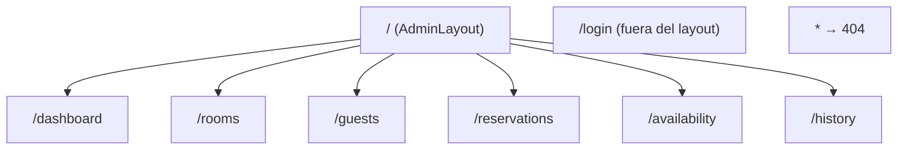

# Design Document: Frontend Foundation

## Overview

Base del frontend administrativo de StayBook: una SPA en **React + Vite + JavaScript** con **React Router**, que consume la API REST del backend FastAPI existente a través de una **capa centralizada de cliente de API**. Este diseño cubre estructura de proyecto, ruteo, layout, cliente de API, configuración por entorno, patrones de carga/error, páginas placeholder, estilos ligeros, expectativas de CORS, verificación de conectividad y estrategia de pruebas.

No se implementa funcionalidad de negocio, ni autenticación/JWT, ni state global. El objetivo es que las specs posteriores (Authentication, Dashboard, Rooms, Guests, Reservations, Availability, History) se implementen sin reestructurar el frontend.

### Hallazgos del repositorio real (base del diseño)

Inspección del repo actual:

- La raíz contiene el backend (`app/`, `alembic/`, `pyproject.toml`, `requirements.txt`, un `Dockerfile` de backend, `README.md`). **No existe `/frontend` todavía**; se creará ahí, aislado del backend.
- **Rutas reales del backend** (todas bajo `/api/v1`, todas requieren JWT admin salvo la documentación):
  - `POST/GET /api/v1/rooms/`, `GET /api/v1/rooms/available`, `GET/PATCH/DELETE /api/v1/rooms/{id}`
  - `POST/GET /api/v1/guests/`, `GET/PATCH /api/v1/guests/{id}`
  - `POST/GET /api/v1/reservations/`, `GET/PATCH /api/v1/reservations/{id}`, `POST /api/v1/reservations/{id}/cancel|check-in|check-out`
  - `GET /api/v1/availability`, `GET /api/v1/occupancy/current`, `GET /api/v1/occupancy/rooms`, `GET /api/v1/history/reservations`
- **No hay middleware CORS** en el backend (búsqueda de `CORSMiddleware`/`add_middleware` sin resultados). Esto es un prerrequisito de integración documentado más abajo.
- **No hay endpoint de login/emisión de token** ni `/health`; `app/core/auth.py` solo **valida** JWT. La documentación pública (`/docs`, `/openapi.json`) no requiere token.
- El `.gitignore` de la raíz ya ignora `.env`, `.env.*` (con `!.env.example`) y `dist/`, pero **no** `node_modules/`. El frontend tendrá su propio `.gitignore`.
- El formato de error del backend es `{"detail": "...", "status_code": <int>}` (handlers globales) y `422` de validación de FastAPI con estructura `{"detail": [ ... ]}`.

## 1. Estructura de directorios `/frontend`

```
/frontend
├── index.html                     # entry HTML de Vite
├── package.json                   # deps: react, react-dom, react-router-dom, vite, @vitejs/plugin-react
├── vite.config.js                 # config Vite (+ proxy /api opcional para dev)
├── .gitignore                     # node_modules, dist, .env locales, etc.
├── .env.example                   # VITE_API_BASE_URL documentada
├── README.md                      # cómo correr el frontend y prerrequisito CORS
└── src/
    ├── main.jsx                   # bootstrap React + RouterProvider
    ├── App.jsx                    # (opcional) composición raíz / providers ligeros
    ├── router/
    │   └── routes.jsx             # definición central de rutas (React Router)
    ├── config/
    │   └── env.js                 # lee VITE_API_BASE_URL + fallback local
    ├── api/
    │   ├── client.js              # cliente HTTP centralizado (get/post/patch)
    │   ├── ApiError.js            # error normalizado de API
    │   └── endpoints.js           # constantes de rutas del backend (/api/v1/...)
    ├── auth/
    │   └── authToken.js           # punto único de token (stub: retorna null por ahora)
    ├── layout/
    │   ├── AdminLayout.jsx        # layout con header + sidebar + <Outlet/>
    │   ├── Sidebar.jsx            # navegación lateral
    │   └── Header.jsx             # encabezado (slot para acciones de sesión)
    ├── components/
    │   ├── Loading.jsx            # patrón de carga reutilizable
    │   ├── ErrorMessage.jsx       # patrón de error reutilizable
    │   ├── NotFound.jsx           # contenido 404
    │   └── PlaceholderPage.jsx    # componente base para placeholders
    ├── hooks/
    │   └── useApi.js              # hook genérico loading/error/data (sin negocio)
    ├── pages/
    │   ├── LoginPage.jsx
    │   ├── DashboardPage.jsx
    │   ├── RoomsPage.jsx
    │   ├── GuestsPage.jsx
    │   ├── ReservationsPage.jsx
    │   ├── AvailabilityPage.jsx
    │   └── HistoryPage.jsx
    └── styles/
        ├── index.css              # reset ligero + variables CSS + base
        └── layout.css             # estilos de layout/sidebar/header
```

Principios: páginas (vistas de ruta), componentes reutilizables, `api/` (servicios) separada de presentación, `config/` para configuración, `layout/` para el chrome de la app. Añadir una sección futura = añadir una página + (opcional) un módulo de servicio, sin tocar la organización principal (Req 2).

## 2. Arquitectura de React Router

Se usa `react-router-dom` con un árbol de rutas declarado en `src/router/routes.jsx` (patrón de objetos de ruta anidados). Login vive **fuera** del `AdminLayout`; las secciones administrativas son **hijas anidadas** del layout mediante `<Outlet/>`. Se incluye una ruta 404 catch-all. La estructura deja preparado un punto para envolver las rutas administrativas en un futuro `<ProtectedRoute>` sin reestructurar.

```
<Routes>
  /login                     → LoginPage            (sin AdminLayout)
  /                          → AdminLayout           (layout persistente)
     index                   → redirect a /dashboard
     /dashboard              → DashboardPage
     /rooms                  → RoomsPage
     /guests                 → GuestsPage
     /reservations           → ReservationsPage
     /availability           → AvailabilityPage
     /history                → HistoryPage
  *                          → NotFound (404)
</Routes>
```

Diagrama:



**Preparación para rutas protegidas (Req 3.6, 9.1):** el grupo administrativo se define como un único nodo padre (`AdminLayout`). Cuando se implemente auth, se insertará un envoltorio `ProtectedRoute` entre el nodo raíz y `AdminLayout` (o como `element` del layout) que redirija a `/login` si no hay sesión. En esta fase **no** se bloquea el acceso (Req 9.5): las páginas placeholder son accesibles para validar la base. Se documenta en el código el lugar exacto (`router/routes.jsx`) donde se insertará esa protección, mediante un comentario y una estructura que no requiere mover las rutas hijas.

**Comportamiento de navegación:**
- Ruta raíz `/` redirige a `/dashboard` (Req 3.4) usando un `index` route con `<Navigate to="/dashboard" replace/>`.
- Ruta desconocida → `NotFound` (Req 3.5), sin romper la app.
- La navegación entre secciones ocurre vía `<NavLink>` (sin recarga completa; Req 4.3).

## 3. Layout principal

`AdminLayout` compone tres regiones y renderiza la página activa vía `<Outlet/>`:

```
┌───────────────────────────────────────────────┐
│ Header  (título/marca StayBook · slot sesión)  │
├──────────────┬────────────────────────────────┤
│ Sidebar      │ Content area (<Outlet/>)        │
│ (NavLinks)   │                                 │
│ Dashboard    │  [Página activa]                │
│ Rooms        │                                 │
│ Guests       │                                 │
│ Reservations │                                 │
│ Availability │                                 │
│ History      │                                 │
└──────────────┴────────────────────────────────┘
```

- **Sidebar** (`Sidebar.jsx`): lista de `<NavLink>` a Dashboard, Rooms, Guests, Reservations, Availability, History. `NavLink` aplica automáticamente una clase "active" al enlace de la ruta actual (Req 4.4).
- **Header** (`Header.jsx`): marca/título y un **slot reservado** para acciones de sesión (p. ej. un botón "Cerrar sesión") — presente pero **sin lógica** en esta fase (Req 4.5).
- **Content area**: `<Outlet/>` donde React Router inyecta la página hija.
- **Login** se renderiza fuera de este layout (Req 4.6).

**Responsividad (Req 11):** enfoque desktop-first con degradación básica. En anchos reducidos, el sidebar colapsa (por CSS: se reduce a íconos/rótulos apilados o se oculta tras un toggle simple basado en estado local del layout). No se introduce librería de UI; se usa CSS Flexbox/Grid y una media query. El objetivo es "no romper el contenido", no un diseño móvil completo.

## 4. Arquitectura del cliente de API centralizado

Un único módulo `src/api/client.js` encapsula todo el acceso HTTP. Los componentes **nunca** usan `fetch` directamente (Req 6.5).

### Contrato

```js
// src/api/client.js  (firma conceptual, no implementación final)
export async function apiGet(path, { params, signal } = {}) { ... }
export async function apiPost(path, body, { signal } = {}) { ... }
export async function apiPatch(path, body, { signal } = {}) { ... }

// internamente:
async function request(method, path, { body, params, signal }) {
  const url = buildUrl(getApiBaseUrl(), path, params);
  const headers = { "Content-Type": "application/json", ...authHeader() };
  let response;
  try {
    response = await fetch(url, { method, headers, body: body ? JSON.stringify(body) : undefined, signal });
  } catch (networkErr) {
    throw new ApiError({ kind: "network", message: "No se pudo conectar con el servidor", cause: networkErr });
  }
  return parseResponse(response); // lanza ApiError normalizado en 4xx/5xx
}
```

Responsabilidades:
- **Base URL configurable** (Req 6.2, 7): `buildUrl` combina `getApiBaseUrl()` (de `config/env.js`) con el `path` (`/api/v1/...`). Sin URLs hardcodeadas en componentes.
- **GET/POST/PATCH** (Req 6.4): helpers explícitos. (DELETE existe en el backend para rooms, pero no se expone en la foundation; se añadirá cuando la spec de Rooms lo requiera — no es negocio ahora.)
- **Parsing JSON** (Req 6.4): `parseResponse` lee JSON cuando `Content-Type` es JSON; maneja `204 No Content` devolviendo `null`.
- **Errores de API normalizados** (Req 6, 8.3): en respuestas 4xx/5xx se construye un `ApiError` con `{ status, kind: "http", detail, payload }`. Se extrae `detail` del cuerpo del backend (`{"detail": "..."}`), y para 422 se conserva el arreglo de errores de validación en `payload` sin interpretarlo (no se duplican reglas del backend).
- **Errores de red** (Req 8.4): un `fetch` que rechaza (backend caído, DNS, CORS bloqueado a nivel de red) se envuelve en `ApiError { kind: "network" }` con mensaje genérico.
- **Punto único de extensión para `Authorization`** (Req 6.3, 9.2): `authHeader()` vive en `src/auth/authToken.js` y hoy es un stub:

```js
// src/auth/authToken.js
export function getToken() { return null; }            // futuro: leer token de sesión
export function authHeader() {
  const t = getToken();
  return t ? { Authorization: `Bearer ${t}` } : {};    // único lugar donde se añadirá el Bearer
}
```

Cuando se implemente auth, solo cambia `getToken()` (y quién lo setea); el cliente y los componentes no se tocan.

### `ApiError` normalizado (`src/api/ApiError.js`)

```js
export class ApiError extends Error {
  constructor({ kind, status = null, detail = null, payload = null, message, cause = null }) {
    super(message || detail || "Error de API");
    this.kind = kind;         // "http" | "network"
    this.status = status;     // 400,401,403,404,409,422,500...
    this.detail = detail;     // mensaje legible del backend
    this.payload = payload;   // cuerpo crudo (p. ej. arreglo de validación 422)
    this.cause = cause;
  }
}
```

### `endpoints.js`

Constantes/estructura de rutas para evitar strings dispersos, p. ej.:

```js
export const ENDPOINTS = {
  rooms: "/api/v1/rooms/",
  room: (id) => `/api/v1/rooms/${id}`,
  guests: "/api/v1/guests/",
  reservations: "/api/v1/reservations/",
  availability: "/api/v1/availability",
  occupancyCurrent: "/api/v1/occupancy/current",
  occupancyRooms: "/api/v1/occupancy/rooms",
  historyReservations: "/api/v1/history/reservations",
};
```

Esto documenta la superficie real del backend sin implementar sus llamadas de negocio.

## 5. Configuración de entorno

`src/config/env.js` centraliza la lectura (Req 7.5):

```js
const DEFAULT_LOCAL = "http://127.0.0.1:8000";  // fallback dev documentado
export function getApiBaseUrl() {
  const raw = import.meta.env.VITE_API_BASE_URL;
  return (raw && raw.trim()) ? raw.replace(/\/+$/, "") : DEFAULT_LOCAL;
}
```

- **`VITE_API_BASE_URL`** (Req 7.1): única variable de configuración de la base del backend (prefijo `VITE_` para exponerse en el cliente).
- **Fallback local** (Req 7.3): si no está definida, usa `http://127.0.0.1:8000` de forma explícita.
- **`.env.example`** (Req 7.2):

```
# URL base del backend FastAPI de StayBook
VITE_API_BASE_URL=http://127.0.0.1:8000
```

- **`.env` locales ignorados por Git** (Req 7.4): el `/frontend/.gitignore` incluirá `.env`, `.env.local`, `.env.*` con excepción `!.env.example`. Sin secretos versionados (la base no usa secretos; el token JWT no se implementa aquí).

## 6. Componentes y patrones de carga/error

- **`Loading.jsx`** (Req 8.1): indicador genérico (spinner/texto "Cargando…"), reutilizable, con prop opcional de etiqueta.
- **`ErrorMessage.jsx`** (Req 8.2, 8.6): recibe un `ApiError` (o mensaje) y muestra un texto orientado al usuario. Para `kind: "network"` muestra "No se pudo conectar con el servidor"; para `kind: "http"` muestra `detail` del backend. **No** interpreta ni reescribe reglas de validación; para 422 puede listar los mensajes que el backend ya envía. Nunca muestra trazas internas (Req 8.3).
- **`useApi.js`** (Req 8.5): hook genérico que estandariza el ciclo `{ data, loading, error, run }` alrededor de una función del cliente de API, para no duplicar el manejo de estado en cada página:

```js
// uso futuro (no en placeholders): const { data, loading, error, run } = useApi(() => apiGet(ENDPOINTS.rooms));
```

En esta fase el hook existe como patrón; las páginas placeholder no lo ejercitan con datos de negocio. La única excepción es la verificación de conectividad (sección 10), que puede usar el patrón contra un endpoint no de negocio.

- **`NotFound.jsx`** (Req 3.5, 11.5): contenido 404 legible con enlace de regreso al Dashboard.

Regla transversal (Req 11.5): ninguna ruta válida queda en blanco; cada una renderiza al menos su placeholder.

## 7. Páginas y rutas placeholder

Todas las páginas usan `PlaceholderPage.jsx` (título + nota "funcionalidad pendiente"), sin lógica de negocio (Req 5):

| Página | Ruta | Dentro de AdminLayout | Sección backend futura |
|--------|------|-----------------------|------------------------|
| `LoginPage` | `/login` | No | Authentication (futuro) |
| `DashboardPage` | `/dashboard` | Sí (default) | Occupancy/summary |
| `RoomsPage` | `/rooms` | Sí | Room Management |
| `GuestsPage` | `/guests` | Sí | Guest Management |
| `ReservationsPage` | `/reservations` | Sí | Reservation + check-in/out |
| `AvailabilityPage` | `/availability` | Sí | Availability |
| `HistoryPage` | `/history` | Sí | Reservation history |

`PlaceholderPage` (patrón):

```jsx
export default function PlaceholderPage({ title, description }) {
  return (
    <section>
      <h1>{title}</h1>
      <p>{description ?? "Esta sección estará disponible próximamente."}</p>
    </section>
  );
}
```

`LoginPage` es placeholder (Req 9.3): muestra un título "Iniciar sesión" y nota de pendiente; **no** implementa formulario funcional, obtención ni almacenamiento de token.

## 8. Organización de estilos (CSS ligero, sin framework)

- **CSS plano modularizado** en `src/styles/` (Req 8/11, restricción "sin UI framework"):
  - `index.css`: reset mínimo, variables CSS (`:root { --color-…; --space-… }`), tipografía base; importado una vez en `main.jsx`.
  - `layout.css`: estilos de `AdminLayout`, `Sidebar`, `Header`, estado activo de `NavLink`, y las media queries de responsividad básica.
- Se permiten **CSS Modules** (`*.module.css`) para componentes puntuales si se desea aislamiento, pero no es obligatorio para la foundation. No se añade Tailwind, MUI, Bootstrap ni similares.
- Consistencia visual entre secciones mediante las variables CSS compartidas (Req 11.3).

## 9. Expectativas de integración CORS con FastAPI

**Hecho verificado:** el backend **no tiene CORS configurado** actualmente. El servidor de dev de Vite corre en un origen distinto (`http://localhost:5173` por defecto) al backend (`http://127.0.0.1:8000`), por lo que las llamadas del navegador serían bloqueadas por la política de CORS del navegador (Req 10.2, 10.4).

Se documentan **dos caminos** (el diseño no modifica el backend; solo documenta expectativas — Req 10.5, 12.6):

- **Camino A (primario, decisión aprobada):** habilitar `CORSMiddleware` en FastAPI de forma explícita y centralizada. La configuración debe permitir el origen del frontend de desarrollo (`http://localhost:5173`), los métodos `GET, POST, PATCH, DELETE, OPTIONS`, los encabezados `Content-Type` y `Authorization` (para el futuro token), y no usar `"*"` como origen cuando se involucren credenciales. La configuración se incluirá como una tarea de integración del backend dentro de esta spec, sin modificar la lógica de negocio del backend. El frontend usará `VITE_API_BASE_URL=http://127.0.0.1:8000` (explícito, no relativo).
- **Camino B (opcional, conveniencia de desarrollo):** el proxy de dev de Vite (`vite.config.js → server.proxy`) puede documentarse como alternativa opcional para desarrolladores que no puedan modificar el backend localmente, pero **la aplicación debe funcionar sin él**. El Camino A es el camino primario y de producción.

El frontend **no** intenta eludir CORS de forma insegura (Req 10.5).

## 10. Estrategia mínima de verificación de conectividad

Objetivo: confirmar que React puede alcanzar FastAPI sin implementar negocio (Req 10.1), y sin depender de autenticación (no hay endpoint de login y los endpoints de negocio devuelven 401 sin token).

- **Sonda recomendada:** `GET {BASE}/openapi.json` (o `/docs`), que es **pública** (no requiere JWT) y siempre está disponible si el backend corre. Una utilidad de conectividad (por ejemplo un pequeño indicador en el Dashboard placeholder, o una función `checkBackendConnectivity()` en `api/`) realiza esta llamada a través del `Cliente_De_API` y reporta:
  - éxito (2xx) → "Backend alcanzable";
  - `ApiError kind:"network"` → "Backend no alcanzable" (caído o CORS bloqueado a nivel de red);
  - cualquier respuesta HTTP → alcanzable (aunque sea 401/404), lo que ya prueba conectividad.
- Esto valida base URL + CORS + transporte sin tocar reglas de negocio. No se persiste ni se muestran datos de negocio.
- Alternativa: si el backend agrega un `/health` en el futuro, la sonda puede apuntar ahí; por ahora `openapi.json` es la opción estable y pública.

> Nota: no se elige un endpoint de negocio como sonda porque devolvería 401 sin token y confundiría "sin auth" con "sin conectividad".

## 11. Estrategia de pruebas (apropiada para la foundation)

Alcance de pruebas acotado a la base (sin negocio). Herramientas ligeras y estándar en el ecosistema Vite/React: **Vitest** + **React Testing Library** (jsdom). No se añade infraestructura pesada.

Pruebas propuestas:

- **Ruteo (Req 3):** renderizar el router en memoria y verificar que `/dashboard`, `/rooms`, `/guests`, `/reservations`, `/availability`, `/history` montan su placeholder; que `/` redirige a `/dashboard`; que una ruta desconocida muestra `NotFound`; que `/login` se renderiza fuera del `AdminLayout` (sin sidebar).
- **Layout/navegación (Req 4):** el `Sidebar` muestra los seis enlaces; el `NavLink` activo refleja la ruta actual; el `Header` renderiza el slot de sesión (sin lógica).
- **Cliente de API (Req 6, 8):** con `fetch` mockeado —
  - `apiGet/apiPost/apiPatch` construyen la URL a partir de la base configurada y serializan/parsean JSON;
  - una respuesta 4xx/5xx produce un `ApiError` con `status` y `detail`;
  - un `204` retorna `null`;
  - un fallo de red produce `ApiError { kind: "network" }`;
  - `authHeader()` no añade `Authorization` mientras `getToken()` retorne `null`, y añade `Bearer <t>` si se stubbea un token (verifica el punto de extensión).
- **Config de entorno (Req 7):** `getApiBaseUrl()` usa `VITE_API_BASE_URL` cuando está definida y cae al default local cuando no; recorta barras finales.
- **Componentes de carga/error (Req 8):** `Loading` renderiza su indicador; `ErrorMessage` muestra mensaje de red vs. `detail` HTTP y nunca trazas.
- **Conectividad (Req 10):** `checkBackendConnectivity()` con `fetch` mockeado devuelve estado "alcanzable/no alcanzable" según la respuesta simulada (no requiere backend real en el test).
- **Build sanity:** el proyecto compila (`vite build`) sin errores como verificación de que la base es coherente.

No se prueban reglas de negocio (no existen en la foundation) ni el flujo de autenticación (no implementado).

## Design Decisions Summary

| Decisión | Elección | Justificación |
|----------|----------|---------------|
| Ubicación | `/frontend` aislado | No mezclar con backend (repo tiene backend en raíz) |
| Ruteo | React Router, layout anidado + Login fuera | Prepara rutas protegidas sin reestructurar |
| Estado | Solo estado local + hook `useApi` | Sin Redux/Zustand (restricción) |
| Acceso HTTP | Cliente central `api/client.js` | Único punto configurable; sin `fetch` en componentes |
| Token | `auth/authToken.js` stub (`getToken()→null`) | Punto único para `Authorization` futuro; sin implementar JWT |
| Base URL | `VITE_API_BASE_URL` + fallback `127.0.0.1:8000` | Config por entorno, dev sin fricción |
| CORS | CORS explícito en backend (primario); proxy Vite documentado como opcional | Backend hoy sin CORS; camino A aprobado |
| Conectividad | Sonda a `/openapi.json` (pública) | Prueba transporte sin auth ni negocio |
| Estilos | CSS plano + variables (+ CSS Modules opcional) | Sin UI framework |
| Tests | Vitest + React Testing Library | Ligero, estándar en Vite |
```
