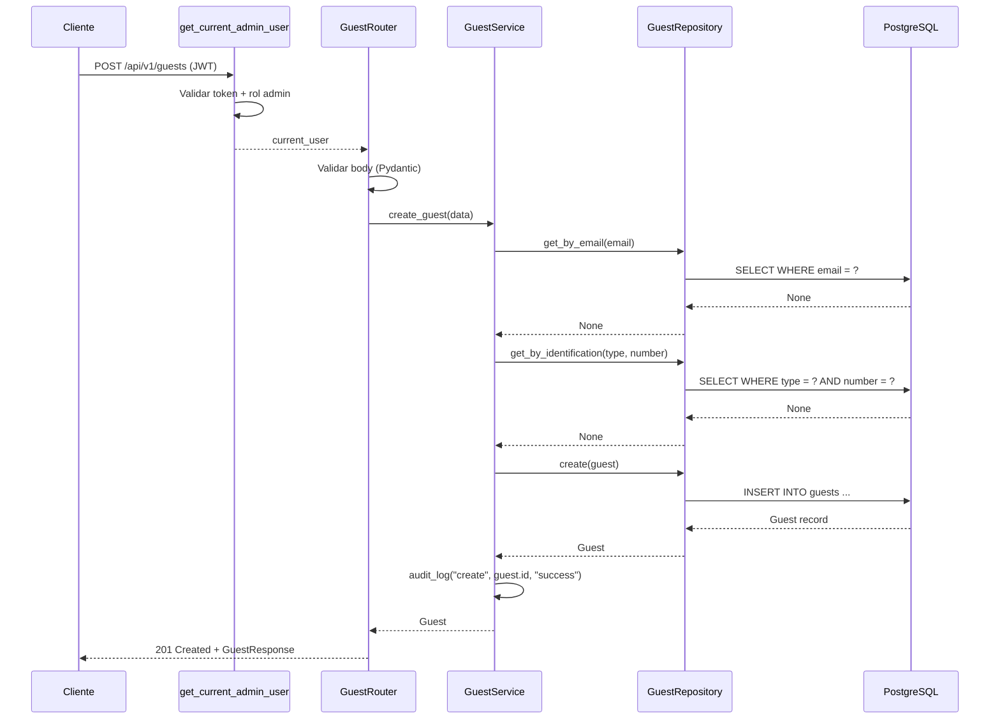

# Design Document: Guest Management

## Overview

El módulo de administración de huéspedes (guest-management) es el segundo módulo funcional de StayBook. Implementa el registro, consulta, listado y actualización de la entidad Huésped, protegido mediante la autenticación/autorización JWT ya existente y con logging de auditoría que nunca expone PII.

El diseño reutiliza fielmente la arquitectura por capas y las convenciones ya establecidas por el módulo de habitaciones (room-management):

- **API Layer** (FastAPI Router) → Recibe HTTP, valida con Pydantic, delega al Service.
- **Service Layer** → Aplica reglas de negocio, coordina operaciones, invoca auditoría.
- **Repository Layer** → Acceso a datos vía SQLAlchemy.
- **Domain Layer** → Modelo SQLAlchemy y schemas Pydantic.
- **Core Layer** → Configuración, excepciones, logging y autenticación (reutilizados).

### Decisiones de Diseño Clave

| Decisión | Elección | Justificación |
|----------|----------|---------------|
| Eliminación | No se implementa | Los datos deben preservarse para el futuro historial de reservas (Req 5.1) |
| Autenticación | Reutiliza `get_current_admin_user` existente | No se introduce middleware nuevo; consistencia con room-management (Req 8.1) |
| Manejo de errores | Reutiliza `AppException` + handlers globales | Mismo formato de error que room-management, sin esquema nuevo (Req 7.2) |
| Unicidad de correo | Constraint UNIQUE en `email` | Evita huéspedes duplicados por contacto (Req 1.2, 4.4) |
| Unicidad de documento | Constraint UNIQUE compuesto `(identification_type, identification_number)` | Un mismo documento no puede repetirse (Req 1.3, 4.5) |
| Actualización parcial | PATCH con campos opcionales (`exclude_unset`) | Mismo patrón que room-management (Req 4.1) |
| IDs | Integer autoincremental, inmutable | Referencia estable para futuros módulos (Req 5.2, 5.3) |
| Tipo de identificación | Enum genérico multinacional | national_id, passport, driver_license, other |

## Architecture

### Diagrama de Componentes

```mermaid
graph TD
    Client[Cliente HTTP] --> Auth[get_current_admin_user<br>Dependency existente]
    Auth --> Router[API Router<br>/api/v1/guests]
    Router --> Schemas[Pydantic Schemas<br>Validación]
    Router --> Service[GuestService]
    Service --> Repo[GuestRepository]
    Repo --> DB[(PostgreSQL)]
    Service --> Logger[audit_log]

    subgraph Core (reutilizado)
        Config[Settings]
        Exceptions[AppException + subclases]
        Logger
        Auth
    end

    subgraph Domain
        Models[SQLAlchemy Model Guest]
        Schemas
    end
```

### Diagrama de Secuencia — Crear Huésped



### Flujo de Dependencias

```
api/guests.py → services/guest_service.py → repositories/guest_repository.py → models/guest.py
     ↓                                              
schemas/guest.py                                     
     ↓
core/exceptions.py, core/auth.py, core/logging.py  (reutilizados)
```

Se respeta la dirección de dependencia estricta: API → Service → Repository → Model, sin dependencias inversas ni circulares (Req 6.4).

## Components and Interfaces

### 1. API Layer — `app/api/guests.py`

Sigue el mismo patrón que `app/api/rooms.py`: un helper `_get_service` construye el servicio con su repositorio a partir de la sesión, y cada endpoint declara `Depends(get_current_admin_user)`.

```python
from fastapi import APIRouter, Depends, status
from sqlalchemy.orm import Session

from app.core.auth import get_current_admin_user
from app.db.session import get_db
from app.repositories.guest_repository import GuestRepository
from app.schemas.guest import GuestCreate, GuestResponse, GuestUpdate
from app.services.guest_service import GuestService

router = APIRouter(prefix="/api/v1/guests", tags=["guests"])


def _get_service(db: Session = Depends(get_db)) -> GuestService:
    return GuestService(GuestRepository(db))


@router.post("/", response_model=GuestResponse, status_code=status.HTTP_201_CREATED)
def create_guest(
    guest_data: GuestCreate,
    current_user: dict = Depends(get_current_admin_user),
    service: GuestService = Depends(_get_service),
) -> GuestResponse:
    """Registrar un nuevo huésped."""
    ...


@router.get("/", response_model=list[GuestResponse])
def list_guests(
    current_user: dict = Depends(get_current_admin_user),
    service: GuestService = Depends(_get_service),
) -> list[GuestResponse]:
    """Listar todos los huéspedes."""
    ...


@router.get("/{guest_id}", response_model=GuestResponse)
def get_guest(
    guest_id: int,
    current_user: dict = Depends(get_current_admin_user),
    service: GuestService = Depends(_get_service),
) -> GuestResponse:
    """Obtener detalle de un huésped por ID."""
    ...


@router.patch("/{guest_id}", response_model=GuestResponse)
def update_guest(
    guest_id: int,
    guest_data: GuestUpdate,
    current_user: dict = Depends(get_current_admin_user),
    service: GuestService = Depends(_get_service),
) -> GuestResponse:
    """Actualizar parcialmente un huésped."""
    ...
```

**Nota:** No se define un endpoint DELETE, en línea con el Requerimiento 5.1 (los huéspedes se preservan para el historial).

### 2. Service Layer — `app/services/guest_service.py`

```python
from app.repositories.guest_repository import GuestRepository
from app.schemas.guest import GuestCreate, GuestUpdate
from app.models.guest import Guest
from app.core.exceptions import (
    GuestNotFoundException,
    GuestEmailDuplicateException,
    GuestIdentificationDuplicateException,
)
from app.core.logging import audit_log


class GuestService:
    def __init__(self, repository: GuestRepository):
        self.repository = repository

    def create_guest(self, data: GuestCreate) -> Guest:
        """
        Crear huésped.
        Reglas:
        - email debe ser único → GuestEmailDuplicateException
        - (identification_type, identification_number) debe ser único
          → GuestIdentificationDuplicateException
        - audit_log("create", guest.id, "success") al completar
        """
        ...

    def list_guests(self) -> list[Guest]:
        """Retornar todos los huéspedes."""
        ...

    def get_guest(self, guest_id: int) -> Guest:
        """
        Obtener huésped por ID.
        Lanza GuestNotFoundException si no existe.
        """
        ...

    def update_guest(self, guest_id: int, data: GuestUpdate) -> Guest:
        """
        Actualización parcial.
        Reglas:
        - El huésped debe existir (GuestNotFoundException)
        - Si cambia email y ya existe en otro huésped → GuestEmailDuplicateException
        - Si cambia (identification_type, identification_number) y ya existe
          en otro huésped → GuestIdentificationDuplicateException
        - Solo se actualizan campos provistos (exclude_unset)
        - id y created_at nunca se modifican (Req 5.3)
        - audit_log("update", guest.id, ...) al completar
        """
        ...
```

**Reglas de negocio (resumen):**

| Regla | Requerimiento | Excepción / Resultado |
|-------|---------------|-----------------------|
| Email único al crear | 1.2 | `GuestEmailDuplicateException` (409) |
| Documento único al crear | 1.3 | `GuestIdentificationDuplicateException` (409) |
| Email único al actualizar (si cambia) | 4.4 | `GuestEmailDuplicateException` (409) |
| Documento único al actualizar (si cambia) | 4.5 | `GuestIdentificationDuplicateException` (409) |
| Huésped inexistente | 3.2, 4.2 | `GuestNotFoundException` (404) |
| Preservar id y created_at | 5.2, 5.3 | No se incluyen en la lógica de update |
| Campos obligatorios nunca vacíos | 5.4 | Garantizado por schemas (validación) |

La detección de duplicados al actualizar solo se ejecuta cuando el valor entrante difiere del actual (mismo patrón que `RoomService.update_room` con `room_number`), evitando falsos positivos al reenviar el mismo email o documento.

### 3. Repository Layer — `app/repositories/guest_repository.py`

Sigue el mismo estilo que `RoomRepository` (uso de `Session`, `flush`/`refresh`, `db.get` por PK).

```python
from sqlalchemy.orm import Session
from app.models.guest import Guest, IdentificationType


class GuestRepository:
    def __init__(self, db: Session):
        self.db = db

    def create(self, guest: Guest) -> Guest:
        """Insertar un nuevo registro de huésped."""
        ...

    def get_by_id(self, guest_id: int) -> Guest | None:
        """Buscar huésped por ID. Retorna None si no existe."""
        ...

    def get_by_email(self, email: str) -> Guest | None:
        """Buscar huésped por email. Retorna None si no existe."""
        ...

    def get_by_identification(
        self, identification_type: IdentificationType, identification_number: str
    ) -> Guest | None:
        """Buscar huésped por documento (tipo + número). Retorna None si no existe."""
        ...

    def get_all(self) -> list[Guest]:
        """Retornar todos los huéspedes."""
        ...

    def update(self, guest: Guest) -> Guest:
        """Persistir cambios en un huésped existente."""
        ...
```

**Nota:** No se define método `delete`, en línea con el Requerimiento 5.1. El repositorio no implementa reglas de negocio ni validaciones de dominio (Req 6.3).

### 4. Authentication Dependency — reutilizada

No se crea ningún componente nuevo de autenticación. El router reutiliza `get_current_admin_user` de `app/core/auth.py` (Req 8.1):

- Token faltante/inválido/expirado → HTTP 401.
- Usuario sin rol `admin` → HTTP 403.
- Token válido con rol `admin` → la solicitud continúa.

El comportamiento es idéntico al del módulo de habitaciones.

### 5. Custom Exceptions — `app/core/exceptions.py` (extensión)

Se agregan tres subclases de la `AppException` ya existente, siguiendo el mismo patrón que las excepciones de Room. No se modifica la clase base ni los handlers.

```python
class GuestNotFoundException(AppException):
    def __init__(self):
        super().__init__(detail="El huésped no fue encontrado", status_code=404)


class GuestEmailDuplicateException(AppException):
    def __init__(self):
        super().__init__(
            detail="El correo electrónico ya está registrado", status_code=409
        )


class GuestIdentificationDuplicateException(AppException):
    def __init__(self):
        super().__init__(
            detail="El documento de identificación ya está registrado",
            status_code=409,
        )
```

### 6. Exception Handling — reutilizado

No se define un esquema de error nuevo (Req 7.2). Se reutilizan los handlers globales ya registrados en `app/main.py`:

- `app_exception_handler` → convierte cualquier `AppException` (incluidas las de huéspedes) en JSON `{"detail", "status_code"}`.
- `generic_exception_handler` → cualquier excepción no controlada → HTTP 500 con mensaje genérico, sin exponer internos.

La validación de Pydantic sigue produciendo HTTP 422 de forma automática vía FastAPI. El router de huéspedes solo debe registrarse en `app/main.py` con `app.include_router(...)`; los handlers ya cubren sus excepciones.

### 7. Audit Logger — `app/core/logging.py` (extensión)

El `audit_log` actual está tipado con el parámetro `room_id`. Para huéspedes se generaliza el identificador manteniendo la firma y el comportamiento (nunca registra tokens, contraseñas ni PII del huésped como email, teléfono o número de identificación — Req 9.2).

Opción de diseño recomendada (mínima y compatible): renombrar el parámetro a `entity_id: int | None` conservando la misma estructura de log, de modo que sirva tanto para rooms como para guests.

```python
def audit_log(operation: str, entity_id: int | None, result: str) -> None:
    """
    Registra operación de auditoría.
    Excluye datos sensibles (tokens, contraseñas, PII del huésped).

    Args:
        operation: "create" | "update" | "delete"
        entity_id: ID de la entidad afectada (room_id o guest_id)
        result: "success" | "failure"
    """
    logger.info(
        "audit_event",
        extra={
            "timestamp": datetime.now(UTC).isoformat(),
            "operation": operation,
            "entity_id": entity_id,
            "result": result,
        },
    )
```

Para guest-management se registran únicamente las operaciones `create` y `update` (no hay `delete`), con timestamp, tipo de operación, `entity_id` = guest_id y resultado (Req 9.1).

> Si se prefiere no tocar la firma existente por compatibilidad, la alternativa es añadir el guest_id posicionalmente igual que hoy con room_id; el punto invariante del diseño es que el log jamás contenga PII del huésped.

## Data Models

### SQLAlchemy Model — `app/models/guest.py`

Mismo estilo que `app/models/room.py`: `Column`, `SAEnum`, timestamps con `server_default=func.now()` y `onupdate=func.now()`, heredando de la misma `Base`.

```python
import enum

from sqlalchemy import Column, DateTime, Integer, String, UniqueConstraint
from sqlalchemy import Enum as SAEnum
from sqlalchemy.sql import func

from app.db.base import Base


class IdentificationType(str, enum.Enum):
    NATIONAL_ID = "national_id"
    PASSPORT = "passport"
    DRIVER_LICENSE = "driver_license"
    OTHER = "other"


class Guest(Base):
    __tablename__ = "guests"

    id = Column(Integer, primary_key=True, autoincrement=True)
    first_name = Column(String(100), nullable=False)
    last_name = Column(String(100), nullable=False)
    email = Column(String(255), unique=True, nullable=False, index=True)
    phone = Column(String(20), nullable=False)
    identification_type = Column(SAEnum(IdentificationType), nullable=False)
    identification_number = Column(String(50), nullable=False)
    created_at = Column(
        DateTime(timezone=True), server_default=func.now(), nullable=False
    )
    updated_at = Column(
        DateTime(timezone=True),
        server_default=func.now(),
        onupdate=func.now(),
        nullable=False,
    )

    __table_args__ = (
        UniqueConstraint(
            "identification_type",
            "identification_number",
            name="uq_guests_identification",
        ),
    )
```

### Pydantic Schemas — `app/schemas/guest.py`

Mismo estilo que `app/schemas/room.py` (`Field` con restricciones, `ConfigDict(from_attributes=True)` en la respuesta). Se usa `EmailStr` para validar el formato de correo.

```python
from datetime import datetime

from pydantic import BaseModel, ConfigDict, EmailStr, Field

from app.models.guest import IdentificationType


class GuestCreate(BaseModel):
    first_name: str = Field(..., min_length=1, max_length=100)
    last_name: str = Field(..., min_length=1, max_length=100)
    email: EmailStr = Field(..., max_length=255)
    phone: str = Field(..., min_length=7, max_length=20)
    identification_type: IdentificationType
    identification_number: str = Field(..., min_length=1, max_length=50)


class GuestUpdate(BaseModel):
    first_name: str | None = Field(None, min_length=1, max_length=100)
    last_name: str | None = Field(None, min_length=1, max_length=100)
    email: EmailStr | None = Field(None, max_length=255)
    phone: str | None = Field(None, min_length=7, max_length=20)
    identification_type: IdentificationType | None = None
    identification_number: str | None = Field(None, min_length=1, max_length=50)


class GuestResponse(BaseModel):
    model_config = ConfigDict(from_attributes=True)

    id: int
    first_name: str
    last_name: str
    email: EmailStr
    phone: str
    identification_type: IdentificationType
    identification_number: str
    created_at: datetime
    updated_at: datetime
```

**Nota sobre validación:** los `min_length` garantizan que los campos obligatorios no queden vacíos (Req 5.4). Para robustez frente a cadenas de solo espacios en `first_name`, `last_name` e `identification_number`, se recomienda un validador que aplique `.strip()` y rechace el resultado vacío. `EmailStr` requiere la dependencia `email-validator` (parte de `pydantic[email]`).

### Database Schema (Alembic Migration)

```sql
CREATE TABLE guests (
    id SERIAL PRIMARY KEY,
    first_name VARCHAR(100) NOT NULL,
    last_name VARCHAR(100) NOT NULL,
    email VARCHAR(255) NOT NULL UNIQUE,
    phone VARCHAR(20) NOT NULL,
    identification_type VARCHAR(20) NOT NULL
        CHECK (identification_type IN ('national_id', 'passport', 'driver_license', 'other')),
    identification_number VARCHAR(50) NOT NULL,
    created_at TIMESTAMPTZ NOT NULL DEFAULT NOW(),
    updated_at TIMESTAMPTZ NOT NULL DEFAULT NOW(),
    CONSTRAINT uq_guests_identification UNIQUE (identification_type, identification_number)
);

CREATE INDEX ix_guests_email ON guests (email);
```

## Uniqueness Constraints

| Constraint | Alcance | Nivel | Validación en Service | HTTP |
|------------|---------|-------|-----------------------|------|
| `email` único | Toda la tabla | `UNIQUE` en columna | `get_by_email` antes de crear/actualizar | 409 |
| `(identification_type, identification_number)` único | Toda la tabla | `UniqueConstraint` compuesto | `get_by_identification` antes de crear/actualizar | 409 |

Defensa en dos niveles: la comprobación previa en el Service devuelve un 409 semántico y limpio; la constraint de base de datos es la garantía final de integridad. Ambos niveles son necesarios y consistentes con cómo room-management maneja `room_number`.

## Error Handling

### Estrategia por Capas (idéntica a room-management)

| Capa | Responsabilidad | Comportamiento |
|------|----------------|----------------|
| Repository | Propaga excepciones de SQLAlchemy | No captura errores de BD |
| Service | Lanza excepciones de dominio | Convierte reglas de negocio en subclases de `AppException` |
| API | Captura global vía handlers existentes | Los handlers producen JSON de error |

### Mapeo de Errores

| Condición | Excepción | HTTP Code |
|-----------|-----------|-----------|
| Huésped no encontrado | `GuestNotFoundException` | 404 |
| Email duplicado | `GuestEmailDuplicateException` | 409 |
| Documento duplicado | `GuestIdentificationDuplicateException` | 409 |
| Validación de datos (Pydantic) | `ValidationError` | 422 |
| Token faltante/inválido | `HTTPException` (auth existente) | 401 |
| Sin rol admin | `HTTPException` (auth existente) | 403 |
| Error de BD/no controlado | `Exception` (catch-all) | 500 |

### Formato de Respuesta de Error

Se reutiliza el formato existente producido por `app_exception_handler`:

```json
{
    "detail": "Descripción legible del error",
    "status_code": 409
}
```

## Audit Logging (sin PII)

- Se registra en cada `create` y `update` (éxito o fallo): timestamp, tipo de operación, id del huésped y resultado (Req 9.1).
- El log **nunca** incluye tokens, contraseñas ni PII del huésped: email, teléfono o número de identificación (Req 9.2).
- Se reutiliza la función `audit_log` de `app/core/logging.py` (generalizando el identificador a `entity_id`).
- El Service invoca `audit_log` de la misma forma que `RoomService` (bloque try/except que registra `"failure"` si la operación de logging falla, sin interrumpir el flujo principal).

## Alembic Migration Requirements

- Nueva revisión (por ejemplo `002_create_guests_table.py`) con `down_revision = "001"`, encadenada tras la migración de rooms.
- `upgrade()` crea la tabla `guests` con todas las columnas, tipos y longitudes definidas en el modelo.
- Constraints:
  - `PrimaryKeyConstraint("id")`
  - `UniqueConstraint("email")`
  - `UniqueConstraint("identification_type", "identification_number", name="uq_guests_identification")`
  - `CheckConstraint` sobre `identification_type IN ('national_id', 'passport', 'driver_license', 'other')` (mismo patrón que `ck_rooms_*`).
- Índices: `ix_guests_email` sobre `email`.
- `downgrade()` elimina índices y la tabla en orden inverso, replicando el estilo de `001_create_rooms_table.py`.
- Se mantiene la convención de usar tipos `String` para los enums en la migración (como en rooms) con la CHECK constraint correspondiente.

## Testing Strategy

Se replica el enfoque dual de room-management (unit + property-based con Hypothesis) manteniendo la misma estructura de carpetas en `tests/`.

### Estructura de Tests

```
tests/
├── unit/
│   ├── test_guest_service.py       # Reglas de negocio del servicio (mocks del repositorio)
│   ├── test_guest_repository.py    # CRUD sin delete, con SQLite en memoria
│   └── test_guest_schemas.py       # Validación Pydantic (obligatorios, longitudes, email)
├── property/
│   └── test_guest_properties.py    # Propiedades de correctitud (round-trip, unicidad, update)
├── integration/
│   ├── test_guest_api.py           # Endpoints + auth (401/403/200/201/404/409/422)
│   └── test_guest_audit_logging.py # Auditoría sin PII
└── conftest.py                     # Fixtures reutilizadas (DB en memoria, JWT mock)
```

### Propiedades de Correctitud (Hypothesis)

Derivadas directamente de los requerimientos aprobados:

- **P1 — Round-trip de creación:** para datos válidos, crear y luego recuperar por ID retorna todos los campos provistos intactos. (Req 1.1, 3.1)
- **P2 — Rechazo de email duplicado:** dos creaciones/actualizaciones con el mismo email → la segunda se rechaza y la primera queda intacta. (Req 1.2, 4.4)
- **P3 — Rechazo de documento duplicado:** dos creaciones/actualizaciones con la misma combinación (tipo, número) → la segunda se rechaza. (Req 1.3, 4.5)
- **P4 — Rechazo de entrada inválida:** datos con al menos un campo inválido (nombre/apellido vacíos o >100, email inválido o >255, phone fuera de 7–20, número de identificación vacío o >50, tipo fuera del enum) → `ValidationError`, sin persistir. (Req 1.4, 4.3)
- **P5 — Preservación en update parcial:** para cualquier subconjunto de campos, el update modifica solo esos campos y preserva el resto, incluidos id y created_at. (Req 4.1, 5.3)
- **P6 — Completitud de listado:** para N huéspedes insertados, `list_guests` retorna exactamente N con todos sus atributos. (Req 2.1)
- **P7 — Enforcement de auth:** sin JWT válido → 401; con JWT válido pero sin rol admin → 403; ningún dato accesible sin credenciales admin. (Req 8.1–8.3)
- **P8 — Seguridad del log de auditoría:** tras create/update, las entradas de log contienen solo operación, timestamp, guest_id y resultado; nunca email, teléfono, número de identificación, tokens ni contraseñas. (Req 9.2)

### Configuración

- `@settings(max_examples=100)` para property tests (misma convención que room-management).
- Fixtures: base SQLite en memoria para unit/property; JWT mock para tests de autenticación.
- Ejecución con `pytest`; linting con `ruff` según `pyproject.toml`.

```bash
pytest tests/unit/ -v
pytest tests/property/ -v
pytest tests/integration/ -v
```
