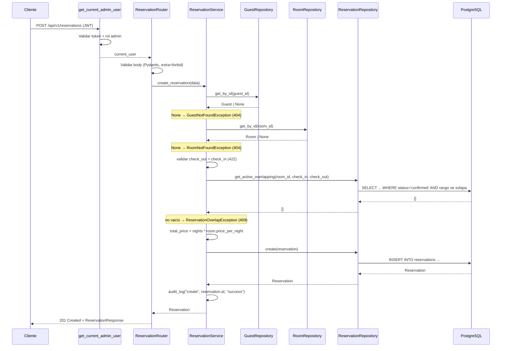

# Design Document: Reservation Management

## Overview

El módulo de administración de reservas (reservation-management) es el tercer módulo funcional de StayBook. Implementa la creación, consulta, listado, actualización y cancelación de reservas que asocian un Huésped existente con una Habitación existente durante un rango de fechas, aplicando reglas de negocio de validación de existencia, validación de fechas, cálculo de precio y prevención de solapamiento.

El diseño reutiliza fielmente la arquitectura por capas y las convenciones ya establecidas por room-management y guest-management:

- **API Layer** (FastAPI Router) → Recibe HTTP, valida con Pydantic, delega al Service.
- **Service Layer** → Aplica reglas de negocio, coordina operaciones, invoca auditoría, reutiliza los repositorios de Room y Guest para validar existencia y obtener el precio.
- **Repository Layer** → Acceso a datos de reservas vía SQLAlchemy.
- **Domain Layer** → Modelo SQLAlchemy y schemas Pydantic.
- **Core Layer** → Configuración, excepciones, logging y autenticación (reutilizados).

### Decisiones de Diseño Clave

| Decisión | Elección | Justificación |
|----------|----------|---------------|
| Eliminación | No se implementa | Las reservas se conservan para fines históricos (Req 8.6) |
| Cancelación | Cambio de `status` a `cancelled` | Cancelación lógica, sin borrado físico (Req 8.1) |
| Autenticación | Reutiliza `get_current_admin_user` | No se introduce middleware nuevo (Req 11.1) |
| Manejo de errores | Reutiliza `AppException` + handlers globales | Mismo formato que rooms/guests, sin esquema nuevo (Req 10.2) |
| Intervalo de reserva | Semiabierto `[check_in, check_out)` | `check_out == check_in` no es solapamiento (Req 4.1, 4.3) |
| `total_price` | Gestionado por el servidor; entrada del cliente rechazada con 422 | Req 1.3, 7.3 mediante `extra="forbid"` en los schemas de entrada |
| Validación de existencia | Reutiliza `RoomRepository` y `GuestRepository` | No duplicar acceso a datos (Req 2.3, 9.5) |
| Precio por noche | Se lee de `Room.price_per_night` | El cliente no lo provee (Req 1.2) |
| Campos actualizables | `room_id`, `check_in_date`, `check_out_date` | Validaciones sobre el estado resultante (Req 7.4) |
| IDs | Integer autoincremental | Consistencia con rooms/guests |

## Architecture

### Diagrama de Componentes

```mermaid
graph TD
    Client[Cliente HTTP] --> Auth[get_current_admin_user<br>Dependency existente]
    Auth --> Router[API Router<br>/api/v1/reservations]
    Router --> Schemas[Pydantic Schemas<br>Validación + extra=forbid]
    Router --> Service[ReservationService]
    Service --> Repo[ReservationRepository]
    Service --> RoomRepo[RoomRepository<br>reutilizado]
    Service --> GuestRepo[GuestRepository<br>reutilizado]
    Repo --> DB[(PostgreSQL)]
    Service --> Logger[audit_log]

    subgraph Core (reutilizado)
        Config[Settings]
        Exceptions[AppException + subclases]
        Logger
        Auth
    end

    subgraph Domain
        Models[SQLAlchemy Model Reservation]
        Schemas
    end
```

### Diagrama de Secuencia — Crear Reserva



### Flujo de Dependencias

```
api/reservations.py → services/reservation_service.py → repositories/reservation_repository.py → models/reservation.py
                                    ↓
              repositories/room_repository.py (reutilizado)
              repositories/guest_repository.py (reutilizado)
                                    ↓
schemas/reservation.py
                                    ↓
core/exceptions.py, core/auth.py, core/logging.py  (reutilizados)
```

Se respeta la dirección de dependencia estricta: API → Service → Repository → Model. El Service depende adicionalmente de los repositorios existentes de Room y Guest (Req 9.4, 9.5), sin dependencias inversas ni circulares.

## Components and Interfaces

### 1. API Layer — `app/api/reservations.py`

Sigue el mismo patrón que `app/api/rooms.py` y `app/api/guests.py`: un helper `_get_service` construye el servicio con sus repositorios a partir de la sesión, y cada endpoint declara `Depends(get_current_admin_user)`.

```python
from fastapi import APIRouter, Depends, status
from sqlalchemy.orm import Session

from app.core.auth import get_current_admin_user
from app.db.session import get_db
from app.repositories.guest_repository import GuestRepository
from app.repositories.reservation_repository import ReservationRepository
from app.repositories.room_repository import RoomRepository
from app.schemas.reservation import (
    ReservationCreate,
    ReservationResponse,
    ReservationUpdate,
)
from app.services.reservation_service import ReservationService

router = APIRouter(prefix="/api/v1/reservations", tags=["reservations"])


def _get_service(db: Session = Depends(get_db)) -> ReservationService:
    return ReservationService(
        repository=ReservationRepository(db),
        room_repository=RoomRepository(db),
        guest_repository=GuestRepository(db),
    )


@router.post("/", response_model=ReservationResponse, status_code=status.HTTP_201_CREATED)
def create_reservation(
    data: ReservationCreate,
    current_user: dict = Depends(get_current_admin_user),
    service: ReservationService = Depends(_get_service),
) -> ReservationResponse:
    """Crear una nueva reserva."""
    ...


@router.get("/", response_model=list[ReservationResponse])
def list_reservations(
    current_user: dict = Depends(get_current_admin_user),
    service: ReservationService = Depends(_get_service),
) -> list[ReservationResponse]:
    """Listar todas las reservas (confirmed y cancelled)."""
    ...


@router.get("/{reservation_id}", response_model=ReservationResponse)
def get_reservation(
    reservation_id: int,
    current_user: dict = Depends(get_current_admin_user),
    service: ReservationService = Depends(_get_service),
) -> ReservationResponse:
    """Obtener detalle de una reserva por ID."""
    ...


@router.patch("/{reservation_id}", response_model=ReservationResponse)
def update_reservation(
    reservation_id: int,
    data: ReservationUpdate,
    current_user: dict = Depends(get_current_admin_user),
    service: ReservationService = Depends(_get_service),
) -> ReservationResponse:
    """Actualizar room_id / fechas de una reserva."""
    ...


@router.post("/{reservation_id}/cancel", response_model=ReservationResponse)
def cancel_reservation(
    reservation_id: int,
    current_user: dict = Depends(get_current_admin_user),
    service: ReservationService = Depends(_get_service),
) -> ReservationResponse:
    """Cancelar una reserva (cambio de status, sin borrado físico)."""
    ...
```

**Notas de diseño de endpoints:**
- La cancelación se modela como `POST /{id}/cancel` (una transición de estado explícita) en lugar de `DELETE`, porque no hay borrado físico y el resultado devuelve la reserva actualizada con `status="cancelled"` y HTTP 200 (Req 8.5). No se registra ninguna ruta `DELETE`.
- El listado incluye reservas `confirmed` y `cancelled` (Req 5.1).

### 2. Service Layer — `app/services/reservation_service.py`

```python
from datetime import date

from app.core.exceptions import (
    GuestNotFoundException,
    RoomNotFoundException,
    ReservationNotFoundException,
    ReservationOverlapException,
    ReservationInvalidDatesException,
    ReservationAlreadyCancelledException,
    ReservationCancelledNotEditableException,
)
from app.core.logging import audit_log
from app.models.reservation import Reservation, ReservationStatus
from app.repositories.guest_repository import GuestRepository
from app.repositories.reservation_repository import ReservationRepository
from app.repositories.room_repository import RoomRepository
from app.schemas.reservation import ReservationCreate, ReservationUpdate


class ReservationService:
    def __init__(
        self,
        repository: ReservationRepository,
        room_repository: RoomRepository,
        guest_repository: GuestRepository,
    ):
        self.repository = repository
        self.room_repository = room_repository
        self.guest_repository = guest_repository

    def create_reservation(self, data: ReservationCreate) -> Reservation: ...
    def list_reservations(self) -> list[Reservation]: ...
    def get_reservation(self, reservation_id: int) -> Reservation: ...
    def update_reservation(self, reservation_id: int, data: ReservationUpdate) -> Reservation: ...
    def cancel_reservation(self, reservation_id: int) -> Reservation: ...
```

**Reglas de negocio (resumen):**

| Regla | Requerimiento | Excepción / Resultado |
|-------|---------------|-----------------------|
| Huésped debe existir | 2.1 | `GuestNotFoundException` (404) |
| Habitación debe existir | 2.2 | `RoomNotFoundException` (404) |
| `check_out > check_in` | 3.1 | `ReservationInvalidDatesException` (422) |
| No solapamiento con activas | 4.2 | `ReservationOverlapException` (409) |
| Intervalo semiabierto | 4.1, 4.3 | `check_out == check_in` de otra reserva NO solapa |
| Canceladas excluidas del chequeo | 4.4 | Se filtran por `status='confirmed'` |
| Update excluye la propia reserva | 4.5, 7.5 | El chequeo omite `reservation.id` |
| `total_price` calculado por servidor | 1.2, 7.6 | `nights * room.price_per_night` |
| No editar reserva cancelada | 7.9 | `ReservationCancelledNotEditableException` (409) |
| No re-cancelar | 8.4 | `ReservationAlreadyCancelledException` (409) |
| Reserva inexistente | 6.2, 7.7, 8.3 | `ReservationNotFoundException` (404) |

**Cálculo de `total_price`:** `Número_De_Noches = (check_out_date - check_in_date).days` (siempre ≥ 1 para una reserva válida, Req 3.2). `total_price = nights * room.price_per_night`. Se usa `Decimal` para preservar la precisión de `Numeric(10, 2)`.

**Orden de validación en `create_reservation`:**
1. `guest = guest_repository.get_by_id(data.guest_id)` → `GuestNotFoundException` si `None`.
2. `room = room_repository.get_by_id(data.room_id)` → `RoomNotFoundException` si `None`.
3. Validar `check_out > check_in` → `ReservationInvalidDatesException`.
4. `overlaps = repository.get_active_overlapping(room_id, check_in, check_out)` → si no vacío, `ReservationOverlapException`.
5. Calcular `total_price` con `room.price_per_night`.
6. Persistir con `status=confirmed`; `audit_log("create", reservation.id, ...)`.

**`update_reservation` (estado resultante — Req 7.4):**
1. Obtener la reserva; `ReservationNotFoundException` si `None`.
2. Si `status == cancelled` → `ReservationCancelledNotEditableException` (409).
3. Construir el estado resultante combinando valores actuales con `data.model_dump(exclude_unset=True)` (solo `room_id`, `check_in_date`, `check_out_date`).
4. Resolver la Habitación resultante (`room_id` resultante) → `RoomNotFoundException` si no existe.
5. Validar fechas del estado resultante → `ReservationInvalidDatesException`.
6. Chequear solapamiento del rango resultante contra activas de la habitación resultante, excluyendo `reservation.id` (Req 7.5) → `ReservationOverlapException`.
7. Recalcular `total_price` con las noches resultantes y el precio por noche de la habitación resultante (Req 7.6).
8. Persistir; `audit_log("update", reservation.id, ...)`.

**`cancel_reservation` (Req 8):**
1. Obtener la reserva; `ReservationNotFoundException` si `None`.
2. Si `status == cancelled` → `ReservationAlreadyCancelledException` (409).
3. Cambiar `status = cancelled` (los demás campos se preservan; `updated_at` se actualiza automáticamente).
4. Persistir; `audit_log("cancel", reservation.id, ...)`.

El Service nunca modifica el `status` de la Habitación (fuera de alcance; check-in/check-out será un spec futuro).

### 3. Repository Layer — `app/repositories/reservation_repository.py`

Sigue el estilo de `RoomRepository`/`GuestRepository` (uso de `Session`, `flush`/`refresh`, `db.get` por PK). No implementa reglas de negocio (Req 9.3); el filtro de solapamiento es una consulta de datos, no una decisión de negocio.

```python
from datetime import date

from sqlalchemy.orm import Session

from app.models.reservation import Reservation, ReservationStatus


class ReservationRepository:
    def __init__(self, db: Session):
        self.db = db

    def create(self, reservation: Reservation) -> Reservation:
        """Insertar una nueva reserva."""
        ...

    def get_by_id(self, reservation_id: int) -> Reservation | None:
        """Buscar reserva por ID. Retorna None si no existe."""
        ...

    def get_all(self) -> list[Reservation]:
        """Retornar todas las reservas (confirmed y cancelled)."""
        ...

    def update(self, reservation: Reservation) -> Reservation:
        """Persistir cambios en una reserva existente."""
        ...

    def get_active_overlapping(
        self,
        room_id: int,
        check_in: date,
        check_out: date,
        exclude_id: int | None = None,
    ) -> list[Reservation]:
        """
        Retornar reservas 'confirmed' de la habitación cuyo rango
        [check_in_date, check_out_date) se solapa con [check_in, check_out).

        Condición de solapamiento (intervalo semiabierto):
            existing.check_in_date < check_out AND existing.check_out_date > check_in

        exclude_id: si se provee, excluye esa reserva del resultado
        (usado durante la actualización de la propia reserva).
        """
        ...
```

**No hay método `delete`**, en línea con Req 8.6 (las reservas se conservan permanentemente).

**Fórmula de solapamiento (semiabierto):** dos intervalos `[a_in, a_out)` y `[b_in, b_out)` se solapan sii `a_in < b_out AND a_out > b_in`. Con esta fórmula, `A: [Sep 1, Sep 5)` y `B: [Sep 5, Sep 8)` NO se solapan porque `A.check_out (Sep 5) > B.check_in (Sep 5)` es falso — cumple Req 4.3.

### 4. Authentication Dependency — reutilizada

No se crea ningún componente nuevo. El router reutiliza `get_current_admin_user` de `app/core/auth.py` (Req 11): 401 para token faltante/inválido/expirado, 403 para no-admin, continúa para admin válido. Comportamiento idéntico a rooms/guests.

### 5. Custom Exceptions — `app/core/exceptions.py` (extensión)

Se agregan subclases de la `AppException` existente, siguiendo el mismo patrón que las excepciones de Room y Guest. No se modifica la clase base ni los handlers. Se reutilizan las excepciones existentes de existencia de entidades para huésped y habitación.

```python
# Reutilizadas (ya existen):
#   GuestNotFoundException      -> 404
#   RoomNotFoundException       -> 404

class ReservationNotFoundException(AppException):
    def __init__(self):
        super().__init__(detail="La reserva no fue encontrada", status_code=404)


class ReservationInvalidDatesException(AppException):
    def __init__(self):
        super().__init__(
            detail="La fecha de salida debe ser posterior a la fecha de entrada",
            status_code=422,
        )


class ReservationOverlapException(AppException):
    def __init__(self):
        super().__init__(
            detail="La habitación ya está reservada en el rango de fechas solicitado",
            status_code=409,
        )


class ReservationCancelledNotEditableException(AppException):
    def __init__(self):
        super().__init__(
            detail="Una reserva cancelada no puede ser modificada",
            status_code=409,
        )


class ReservationAlreadyCancelledException(AppException):
    def __init__(self):
        super().__init__(
            detail="La reserva ya se encuentra cancelada",
            status_code=409,
        )
```

**Nota sobre el 422 de fechas:** aunque `ReservationInvalidDatesException` produce 422, la validación de `check_out > check_in` puede realizarse también a nivel de schema Pydantic (validador de modelo) para fallar temprano en la capa API. El diseño contempla ambas: Pydantic rechaza en la entrada (422 nativo de FastAPI) y el Service mantiene la invariante como salvaguarda de dominio. Ver sección de schemas.

### 6. Exception Handling — reutilizado

No se define un esquema de error nuevo (Req 10.2). Se reutilizan los handlers globales ya registrados en `app/main.py`:
- `app_exception_handler` → `AppException` (incluidas las de reservas) → JSON `{"detail", "status_code"}`.
- `generic_exception_handler` → excepción no controlada → HTTP 500 genérico.

La validación de Pydantic sigue produciendo HTTP 422 automáticamente vía FastAPI. El router de reservas solo debe registrarse en `app/main.py` con `app.include_router(...)`.

### 7. Audit Logger — `app/core/logging.py` (reutilizado)

Se reutiliza `audit_log(operation, room_id, result)` tal como en rooms/guests (Opción A ya adoptada en guest-management: la firma se mantiene y el identificador de entidad se pasa posicionalmente). Para reservas se registran `create`, `update` y `cancel`, con timestamp, id de la reserva y resultado (Req 12.1).

El log **nunca** incluye PII del huésped ni datos sensibles (Req 12.2): solo operación, timestamp, id de reserva y resultado. El Service usa el mismo bloque try/except que Room y Guest para registrar `"failure"` si el logging falla, sin interrumpir el flujo.

## Data Models

### SQLAlchemy Model — `app/models/reservation.py`

Mismo estilo que `app/models/room.py` y `app/models/guest.py`: `Column`, `SAEnum`, `ForeignKey`, timestamps con `server_default=func.now()` y `onupdate=func.now()`, heredando de la misma `Base`.

```python
import enum

from sqlalchemy import (
    Column,
    Date,
    DateTime,
    ForeignKey,
    Integer,
    Numeric,
)
from sqlalchemy import Enum as SAEnum
from sqlalchemy.sql import func

from app.db.base import Base


class ReservationStatus(str, enum.Enum):
    CONFIRMED = "confirmed"
    CANCELLED = "cancelled"


class Reservation(Base):
    __tablename__ = "reservations"

    id = Column(Integer, primary_key=True, autoincrement=True)
    guest_id = Column(
        Integer,
        ForeignKey("guests.id"),
        nullable=False,
        index=True,
    )
    room_id = Column(
        Integer,
        ForeignKey("rooms.id"),
        nullable=False,
        index=True,
    )
    check_in_date = Column(Date, nullable=False)
    check_out_date = Column(Date, nullable=False)
    status = Column(
        SAEnum(ReservationStatus),
        nullable=False,
        default=ReservationStatus.CONFIRMED,
        index=True,
    )
    total_price = Column(Numeric(10, 2), nullable=False)
    created_at = Column(
        DateTime(timezone=True), server_default=func.now(), nullable=False
    )
    updated_at = Column(
        DateTime(timezone=True),
        server_default=func.now(),
        onupdate=func.now(),
        nullable=False,
    )
```

**Relaciones de clave foránea:** `guest_id → guests.id` y `room_id → rooms.id` (Req 2, entity definition). Se indexan `guest_id`, `room_id` y `status` para las consultas de solapamiento y listado. Se mantiene la simplicidad: no se definen `relationship()` de SQLAlchemy porque el Service resuelve las entidades vía los repositorios existentes (Req 2.3, 9.5); las FKs garantizan integridad referencial a nivel de BD.

**Nota sobre precisión de precio:** `total_price` usa `Numeric(10, 2)` para acomodar `price_per_night` (`Numeric(8, 2)` en Room) multiplicado por el número de noches sin desbordar.

### Pydantic Schemas — `app/schemas/reservation.py`

Mismo estilo que los schemas de room/guest (`Field` con restricciones, `ConfigDict(from_attributes=True)` en la respuesta). Los schemas de entrada usan `extra="forbid"` para rechazar campos gestionados por el servidor (en particular `total_price`) con HTTP 422 (Req 1.3, 7.3).

```python
from datetime import date, datetime
from decimal import Decimal

from pydantic import BaseModel, ConfigDict, Field, model_validator

from app.models.reservation import ReservationStatus


class ReservationCreate(BaseModel):
    # extra="forbid": si el cliente envía total_price, status u otro campo
    # gestionado por el servidor, Pydantic rechaza con 422.
    model_config = ConfigDict(extra="forbid")

    guest_id: int = Field(..., gt=0)
    room_id: int = Field(..., gt=0)
    check_in_date: date
    check_out_date: date

    @model_validator(mode="after")
    def _check_dates(self):
        if self.check_out_date <= self.check_in_date:
            raise ValueError(
                "check_out_date debe ser posterior a check_in_date"
            )
        return self


class ReservationUpdate(BaseModel):
    model_config = ConfigDict(extra="forbid")

    room_id: int | None = Field(None, gt=0)
    check_in_date: date | None = None
    check_out_date: date | None = None
    # Nota: la validación check_out > check_in del estado *resultante*
    # se realiza en el Service (Req 7.4), ya que un update parcial puede
    # proveer solo una de las dos fechas.


class ReservationResponse(BaseModel):
    model_config = ConfigDict(from_attributes=True)

    id: int
    guest_id: int
    room_id: int
    check_in_date: date
    check_out_date: date
    status: ReservationStatus
    total_price: Decimal
    created_at: datetime
    updated_at: datetime
```

**Campos gestionados por el servidor:** `id`, `status`, `total_price`, `created_at`, `updated_at` no aparecen en los schemas de entrada. Gracias a `extra="forbid"`, cualquier intento del cliente de enviarlos (por ejemplo `total_price`) produce 422 en lugar de ser ignorado silenciosamente (Req 1.3, 7.3). `status` se inicializa a `confirmed` en el Service/BD; la transición a `cancelled` ocurre solo vía el endpoint de cancelación.

### Database Schema (Alembic Migration)

```sql
CREATE TABLE reservations (
    id SERIAL PRIMARY KEY,
    guest_id INTEGER NOT NULL REFERENCES guests(id),
    room_id INTEGER NOT NULL REFERENCES rooms(id),
    check_in_date DATE NOT NULL,
    check_out_date DATE NOT NULL,
    status VARCHAR(9) NOT NULL DEFAULT 'confirmed'
        CHECK (status IN ('confirmed', 'cancelled')),
    total_price NUMERIC(10, 2) NOT NULL,
    created_at TIMESTAMPTZ NOT NULL DEFAULT NOW(),
    updated_at TIMESTAMPTZ NOT NULL DEFAULT NOW(),
    CONSTRAINT ck_reservations_dates CHECK (check_out_date > check_in_date)
);

CREATE INDEX ix_reservations_guest_id ON reservations (guest_id);
CREATE INDEX ix_reservations_room_id ON reservations (room_id);
CREATE INDEX ix_reservations_status ON reservations (status);
```

## Error Handling

### Estrategia por Capas (idéntica a rooms/guests)

| Capa | Responsabilidad | Comportamiento |
|------|----------------|----------------|
| Repository | Propaga excepciones de SQLAlchemy | No captura errores de BD |
| Service | Lanza excepciones de dominio | Convierte reglas de negocio en subclases de `AppException` |
| API | Captura global vía handlers existentes | Los handlers producen JSON de error |

### Mapeo de Errores

| Condición | Excepción | HTTP Code |
|-----------|-----------|-----------|
| Reserva no encontrada | `ReservationNotFoundException` | 404 |
| Huésped no encontrado | `GuestNotFoundException` (reutilizada) | 404 |
| Habitación no encontrada | `RoomNotFoundException` (reutilizada) | 404 |
| `check_out <= check_in` (dominio) | `ReservationInvalidDatesException` | 422 |
| Fechas inválidas / body inválido (schema) | `ValidationError` (Pydantic) | 422 |
| `total_price`/campo extra enviado por el cliente | `ValidationError` (extra=forbid) | 422 |
| Solapamiento con reserva activa | `ReservationOverlapException` | 409 |
| Actualizar reserva cancelada | `ReservationCancelledNotEditableException` | 409 |
| Cancelar reserva ya cancelada | `ReservationAlreadyCancelledException` | 409 |
| Error de BD/no controlado | `Exception` (catch-all) | 500 |

### Formato de Respuesta de Error

Se reutiliza el formato existente producido por `app_exception_handler`:

```json
{
    "detail": "Descripción legible del error",
    "status_code": 409
}
```

## Audit Logging (sin PII)

- Se registra en cada `create`, `update` y `cancel` (éxito o fallo): timestamp, tipo de operación, id de la reserva y resultado (Req 12.1).
- El log **nunca** incluye tokens, contraseñas ni PII del huésped (nombre, email, teléfono, documento) — solo operación, timestamp, id de reserva y resultado (Req 12.2). Nótese que el `guest_id`/`room_id` son identificadores internos, no PII.
- Se reutiliza la función `audit_log` de `app/core/logging.py` (Opción A: firma sin cambios, id posicional), igual que en rooms/guests.

## Alembic Migration Requirements

- Nueva revisión (por ejemplo `003_create_reservations_table.py`) con `down_revision = "002"`, encadenada tras la migración de guests. Registrar `from app.models.reservation import Reservation` en `alembic/env.py` (`# noqa: F401`) como ya se hace con Room y Guest.
- `upgrade()` crea la tabla `reservations` con todas las columnas, tipos y longitudes definidas en el modelo.
- Constraints:
  - `PrimaryKeyConstraint("id")`
  - `ForeignKeyConstraint(["guest_id"], ["guests.id"])`
  - `ForeignKeyConstraint(["room_id"], ["rooms.id"])`
  - `CheckConstraint("status IN ('confirmed', 'cancelled')", name="ck_reservations_status")`
  - `CheckConstraint("check_out_date > check_in_date", name="ck_reservations_dates")`
- Índices: `ix_reservations_guest_id`, `ix_reservations_room_id`, `ix_reservations_status`.
- `downgrade()` elimina índices y la tabla en orden inverso, replicando el estilo de `001_create_rooms_table.py` y `002_create_guests_table.py`.
- Se mantiene la convención de usar tipo `String` para el enum en la migración (como en rooms/guests) con su CHECK constraint.

## Testing Strategy

Se replica el enfoque dual de rooms/guests (unit + property-based con Hypothesis) manteniendo la misma estructura de carpetas en `tests/`.

### Estructura de Tests

```
tests/
├── unit/
│   ├── test_reservation_service.py       # Reglas de negocio (repos mockeados)
│   ├── test_reservation_repository.py    # CRUD + get_active_overlapping (SQLite en memoria)
│   └── test_reservation_schemas.py       # Validación Pydantic (extra=forbid, fechas)
├── property/
│   └── test_reservation_properties.py    # Propiedades de correctitud
└── integration/
    ├── test_reservation_api.py           # Endpoints + auth (401/403/200/201/404/409/422)
    └── test_reservation_audit_logging.py # Auditoría sin PII
```

Las pruebas de integración usan el mismo patrón que guest-management: `StaticPool` con SQLite en memoria compartido, `get_db` sobrescrito por dependencia y un JWT admin mock. Como `reservations` tiene FKs a `guests` y `rooms`, las fixtures crean primero un huésped y una habitación (mediante los servicios/repositorios existentes) antes de crear reservas.

### Propiedades de Correctitud (Hypothesis)

Derivadas directamente de los requerimientos aprobados:

- **P1 — Round-trip de creación:** para datos válidos (huésped y habitación existentes, fechas válidas, sin solapamiento), crear y luego recuperar por ID retorna los mismos valores, con `status="confirmed"`. (Req 1.1, 6.1)
- **P2 — Cálculo de `total_price`:** para cualquier reserva válida, `total_price == nights * room.price_per_night`, con `nights = (check_out - check_in).days`. (Req 1.2, 3.2)
- **P3 — Rechazo de `total_price` del cliente:** para cualquier payload de creación/actualización que incluya `total_price` (u otro campo del servidor), el schema lo rechaza con `ValidationError` (422). (Req 1.3, 7.3)
- **P4 — Validación de fechas:** para cualquier par con `check_out <= check_in`, la operación se rechaza (422) y no se persiste. (Req 3.1)
- **P5 — No solapamiento (semiabierto):** para dos reservas activas de la misma habitación cuyos rangos `[in, out)` se intersectan, la segunda se rechaza (409); si son adyacentes (`out == in`), ambas se permiten. (Req 4.1, 4.2, 4.3)
- **P6 — Canceladas liberan el rango:** una reserva cancelada se excluye del chequeo de solapamiento; su rango queda disponible para una nueva reserva de la misma habitación. (Req 4.4)
- **P7 — Update sobre estado resultante:** para un update parcial (solo algunos de `room_id`, `check_in_date`, `check_out_date`), las validaciones y el recálculo de precio operan sobre el estado resultante y la propia reserva se excluye de su chequeo de solapamiento. (Req 7.4, 7.5, 7.6)
- **P8 — Cancelación sin borrado:** cancelar cambia `status` a `cancelled`, preserva los demás campos y la reserva sigue existiendo y siendo recuperable/listable; re-cancelar devuelve 409. (Req 8.1, 8.2, 8.4, 8.6)
- **P9 — Existencia de entidades:** crear/actualizar con `guest_id` o `room_id` inexistentes se rechaza con 404. (Req 2.1, 2.2)
- **P10 — Enforcement de auth:** sin JWT válido → 401; con JWT válido pero sin rol admin → 403; ningún dato de reserva accesible sin credenciales admin. (Req 11.1–11.3)
- **P11 — Seguridad del log de auditoría:** tras create/update/cancel, las entradas de log contienen solo operación, timestamp, id de reserva y resultado; nunca PII del huésped, tokens ni contraseñas. (Req 12.1, 12.2)

### Unit Tests (ejemplos específicos)

- Casos de éxito: crear reserva con fechas concretas y verificar `total_price`.
- Edge cases del solapamiento: rangos adyacentes (`Sep 1–5` y `Sep 5–8` no solapan), contención, intersección parcial, mismo rango.
- Transiciones de estado: cancelar confirmada (OK), cancelar cancelada (409), editar cancelada (409).
- Repositorio: `get_active_overlapping` con `exclude_id` y con reservas canceladas presentes.

### Configuración

- `@settings(max_examples=100)` para property tests (misma convención que rooms/guests).
- Fixtures: SQLite en memoria para unit/property; para integración, `StaticPool` + `get_db` override + JWT admin mock, sembrando huésped y habitación previos.
- Ejecución con `pytest`; linting con `ruff` según `pyproject.toml`.

```bash
pytest tests/unit/ -v
pytest tests/property/ -v
pytest tests/integration/ -v
```
