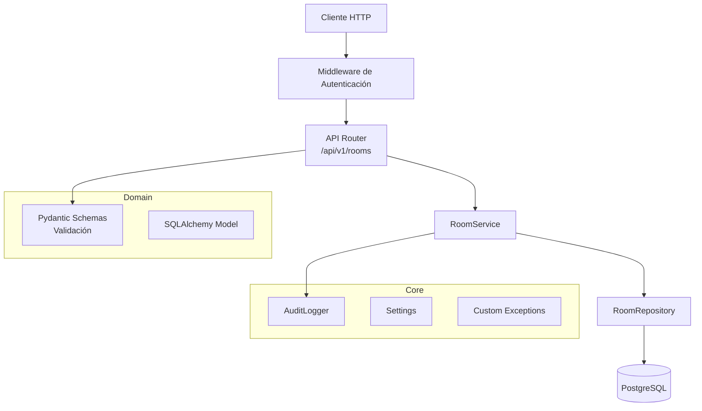
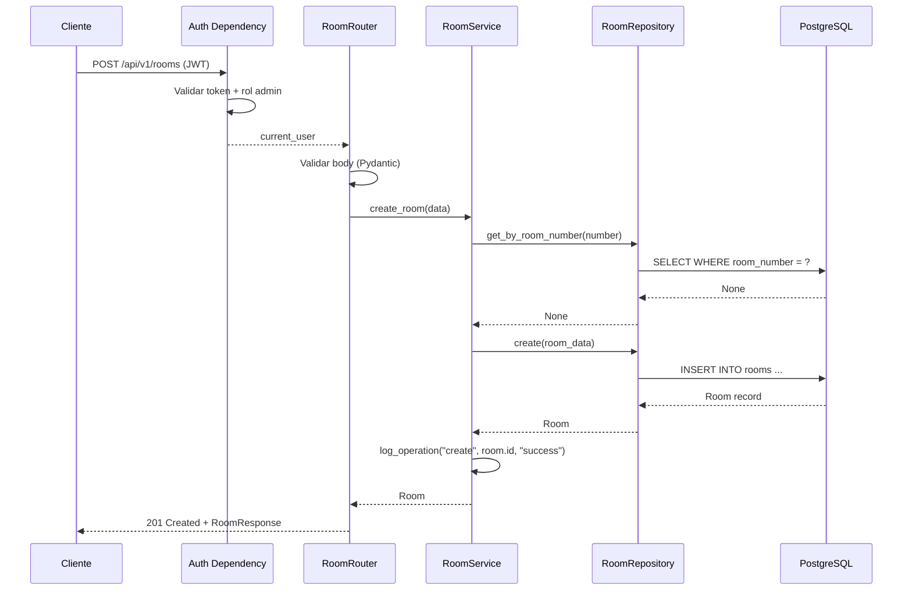
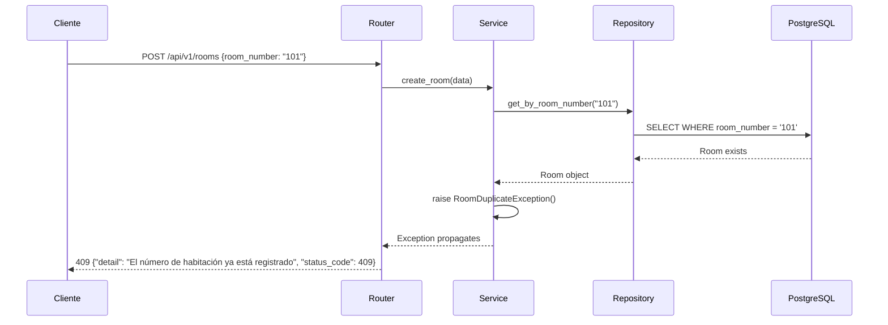

# Design Document: Room Management

## Overview

El módulo de administración de habitaciones (room-management) es el primer módulo funcional de StayBook. Implementa operaciones CRUD completas sobre la entidad Habitación, incluyendo consulta de disponibilidad, protección mediante JWT y logging de auditoría.

El diseño sigue la arquitectura por capas definida en el proyecto:
- **API Layer** (FastAPI Router) → Recibe HTTP, valida con Pydantic, delega al Service
- **Service Layer** → Aplica reglas de negocio, coordina operaciones
- **Repository Layer** → Acceso a datos via SQLAlchemy
- **Core Layer** → Configuración, excepciones, logging

### Decisiones de Diseño Clave

| Decisión | Elección | Justificación |
|----------|----------|---------------|
| Eliminación | Hard delete | Requisito explícito del MVP (Req 5.6) |
| Autenticación | JWT via middleware/dependency | FastAPI dependencies permiten reutilización limpia |
| Validación | Pydantic schemas | Integración nativa con FastAPI, validación declarativa |
| Actualización parcial | PATCH con campos opcionales | Permite modificar solo los atributos necesarios |
| IDs | Integer autoincremental | Simplicidad para el MVP de un solo hotel |

## Architecture

### Diagrama de Componentes



### Diagrama de Secuencia — Crear Habitación



### Flujo de Dependencias

```
api/rooms.py → services/room_service.py → repositories/room_repository.py → models/room.py
     ↓                                              
schemas/room.py                                     
     ↓
core/exceptions.py, core/config.py, core/logging.py
```

## Components and Interfaces

### 1. API Layer — `app/api/rooms.py`

```python
from fastapi import APIRouter, Depends, status
from app.schemas.room import RoomCreate, RoomUpdate, RoomResponse
from app.services.room_service import RoomService
from app.core.auth import get_current_admin_user

router = APIRouter(prefix="/api/v1/rooms", tags=["rooms"])


@router.post("/", response_model=RoomResponse, status_code=status.HTTP_201_CREATED)
async def create_room(
    room_data: RoomCreate,
    current_user=Depends(get_current_admin_user),
    service: RoomService = Depends(),
) -> RoomResponse:
    """Registrar una nueva habitación."""
    ...


@router.get("/", response_model=list[RoomResponse])
async def list_rooms(
    current_user=Depends(get_current_admin_user),
    service: RoomService = Depends(),
) -> list[RoomResponse]:
    """Listar todas las habitaciones."""
    ...


@router.get("/available", response_model=list[RoomResponse])
async def list_available_rooms(
    current_user=Depends(get_current_admin_user),
    service: RoomService = Depends(),
) -> list[RoomResponse]:
    """Listar habitaciones disponibles."""
    ...


@router.get("/{room_id}", response_model=RoomResponse)
async def get_room(
    room_id: int,
    current_user=Depends(get_current_admin_user),
    service: RoomService = Depends(),
) -> RoomResponse:
    """Obtener detalle de una habitación por ID."""
    ...


@router.patch("/{room_id}", response_model=RoomResponse)
async def update_room(
    room_id: int,
    room_data: RoomUpdate,
    current_user=Depends(get_current_admin_user),
    service: RoomService = Depends(),
) -> RoomResponse:
    """Actualizar parcialmente una habitación."""
    ...


@router.delete("/{room_id}", status_code=status.HTTP_204_NO_CONTENT)
async def delete_room(
    room_id: int,
    current_user=Depends(get_current_admin_user),
    service: RoomService = Depends(),
) -> None:
    """Eliminar una habitación (hard delete)."""
    ...
```

### 2. Service Layer — `app/services/room_service.py`

```python
from app.repositories.room_repository import RoomRepository
from app.schemas.room import RoomCreate, RoomUpdate
from app.models.room import Room
from app.core.exceptions import RoomNotFoundException, RoomDuplicateException, RoomOccupiedException
from app.core.logging import audit_log


class RoomService:
    def __init__(self, repository: RoomRepository):
        self.repository = repository

    def create_room(self, data: RoomCreate) -> Room:
        """
        Crear habitación.
        Reglas:
        - room_number debe ser único
        - status se inicializa como 'disponible' si no se proporciona
        """
        ...

    def list_rooms(self) -> list[Room]:
        """Retornar todas las habitaciones."""
        ...

    def list_available_rooms(self) -> list[Room]:
        """Retornar solo habitaciones con status='disponible'."""
        ...

    def get_room(self, room_id: int) -> Room:
        """
        Obtener habitación por ID.
        Lanza RoomNotFoundException si no existe.
        """
        ...

    def update_room(self, room_id: int, data: RoomUpdate) -> Room:
        """
        Actualización parcial.
        Reglas:
        - La habitación debe existir
        - Si se cambia room_number, no debe existir duplicado
        - Solo se actualizan campos proporcionados (exclude_unset)
        """
        ...

    def delete_room(self, room_id: int) -> None:
        """
        Eliminación permanente (hard delete).
        Reglas:
        - La habitación debe existir
        - No se puede eliminar si status='ocupada'
        - Se permite eliminar si status='mantenimiento' o 'disponible'
        """
        ...
```

### 3. Repository Layer — `app/repositories/room_repository.py`

```python
from sqlalchemy.orm import Session
from app.models.room import Room


class RoomRepository:
    def __init__(self, db: Session):
        self.db = db

    def create(self, room: Room) -> Room:
        """Insertar un nuevo registro de habitación."""
        ...

    def get_by_id(self, room_id: int) -> Room | None:
        """Buscar habitación por ID. Retorna None si no existe."""
        ...

    def get_by_room_number(self, room_number: str) -> Room | None:
        """Buscar habitación por número. Retorna None si no existe."""
        ...

    def get_all(self) -> list[Room]:
        """Retornar todas las habitaciones."""
        ...

    def get_available(self) -> list[Room]:
        """Retornar habitaciones con status='disponible'."""
        ...

    def update(self, room: Room) -> Room:
        """Persistir cambios en una habitación existente."""
        ...

    def delete(self, room: Room) -> None:
        """Eliminar físicamente el registro de la habitación."""
        ...
```

### 4. Authentication Dependency — `app/core/auth.py`

```python
from fastapi import Depends, HTTPException, status
from fastapi.security import HTTPBearer, HTTPAuthorizationCredentials
import jwt
from app.core.config import settings

security = HTTPBearer()


def get_current_user(
    credentials: HTTPAuthorizationCredentials = Depends(security),
) -> dict:
    """
    Decodifica y valida el JWT.
    Lanza HTTP 401 si token inválido/expirado/malformado.
    """
    ...


def get_current_admin_user(
    current_user: dict = Depends(get_current_user),
) -> dict:
    """
    Verifica que el usuario tenga rol 'admin'.
    Lanza HTTP 403 si no tiene permisos.
    """
    ...
```

### 5. Custom Exceptions — `app/core/exceptions.py`

```python
class AppException(Exception):
    """Base exception para el dominio."""
    def __init__(self, detail: str, status_code: int):
        self.detail = detail
        self.status_code = status_code


class RoomNotFoundException(AppException):
    def __init__(self):
        super().__init__(detail="La habitación no fue encontrada", status_code=404)


class RoomDuplicateException(AppException):
    def __init__(self):
        super().__init__(
            detail="El número de habitación ya está registrado", status_code=409
        )


class RoomOccupiedException(AppException):
    def __init__(self):
        super().__init__(
            detail="No se puede eliminar una habitación ocupada", status_code=409
        )
```

### 6. Exception Handler — `app/core/exception_handlers.py`

```python
from fastapi import Request
from fastapi.responses import JSONResponse
from app.core.exceptions import AppException


async def app_exception_handler(request: Request, exc: AppException) -> JSONResponse:
    """Handler global para excepciones de dominio."""
    return JSONResponse(
        status_code=exc.status_code,
        content={"detail": exc.detail, "status_code": exc.status_code},
    )


async def generic_exception_handler(request: Request, exc: Exception) -> JSONResponse:
    """Handler para excepciones no controladas — no expone detalles internos."""
    return JSONResponse(
        status_code=500,
        content={"detail": "Error interno del servidor", "status_code": 500},
    )
```

### 7. Audit Logger — `app/core/logging.py`

```python
import logging
from datetime import datetime, timezone

logger = logging.getLogger("staybook.audit")


def audit_log(
    operation: str,
    room_id: int | None,
    result: str,
) -> None:
    """
    Registra operación de auditoría.
    Excluye datos sensibles (tokens, contraseñas).
    
    Args:
        operation: "create" | "update" | "delete"
        room_id: ID de la habitación afectada
        result: "success" | "failure"
    """
    logger.info(
        "audit_event",
        extra={
            "timestamp": datetime.now(timezone.utc).isoformat(),
            "operation": operation,
            "room_id": room_id,
            "result": result,
        },
    )
```

### 8. Configuration — `app/core/config.py`

```python
from pydantic_settings import BaseSettings


class Settings(BaseSettings):
    database_url: str
    secret_key: str
    jwt_algorithm: str = "HS256"
    jwt_expiration_minutes: int = 60
    app_port: int = 8000
    debug: bool = False

    class Config:
        env_file = ".env"
        env_file_encoding = "utf-8"


settings = Settings()
```

## Data Models

### SQLAlchemy Model — `app/models/room.py`

```python
from sqlalchemy import Column, Integer, String, Numeric, DateTime, Enum as SAEnum
from sqlalchemy.sql import func
from app.db.base import Base
import enum


class RoomType(str, enum.Enum):
    INDIVIDUAL = "individual"
    DOBLE = "doble"
    SUITE = "suite"


class RoomStatus(str, enum.Enum):
    DISPONIBLE = "disponible"
    OCUPADA = "ocupada"
    MANTENIMIENTO = "mantenimiento"


class Room(Base):
    __tablename__ = "rooms"

    id = Column(Integer, primary_key=True, autoincrement=True)
    room_number = Column(String(10), unique=True, nullable=False, index=True)
    room_type = Column(SAEnum(RoomType), nullable=False)
    price_per_night = Column(Numeric(8, 2), nullable=False)
    capacity = Column(Integer, nullable=False)
    status = Column(SAEnum(RoomStatus), nullable=False, default=RoomStatus.DISPONIBLE)
    description = Column(String(255), nullable=True)
    floor = Column(Integer, nullable=True)
    created_at = Column(DateTime(timezone=True), server_default=func.now(), nullable=False)
    updated_at = Column(
        DateTime(timezone=True), server_default=func.now(), onupdate=func.now(), nullable=False
    )
```

### Pydantic Schemas — `app/schemas/room.py`

```python
from pydantic import BaseModel, Field, ConfigDict
from datetime import datetime
from app.models.room import RoomType, RoomStatus


class RoomCreate(BaseModel):
    room_number: str = Field(..., max_length=10, description="Número de habitación")
    room_type: RoomType
    price_per_night: float = Field(..., gt=0, le=999999.99)
    capacity: int = Field(..., ge=1, le=20)
    status: RoomStatus = RoomStatus.DISPONIBLE
    description: str | None = Field(None, max_length=255)
    floor: int | None = None


class RoomUpdate(BaseModel):
    room_number: str | None = Field(None, max_length=10)
    room_type: RoomType | None = None
    price_per_night: float | None = Field(None, gt=0, le=999999.99)
    capacity: int | None = Field(None, ge=1, le=20)
    status: RoomStatus | None = None
    description: str | None = Field(None, max_length=255)
    floor: int | None = None


class RoomResponse(BaseModel):
    model_config = ConfigDict(from_attributes=True)

    id: int
    room_number: str
    room_type: RoomType
    price_per_night: float
    capacity: int
    status: RoomStatus
    description: str | None
    floor: int | None
    created_at: datetime
    updated_at: datetime
```

### Database Schema (Alembic Migration)

```sql
CREATE TABLE rooms (
    id SERIAL PRIMARY KEY,
    room_number VARCHAR(10) NOT NULL UNIQUE,
    room_type VARCHAR(12) NOT NULL CHECK (room_type IN ('individual', 'doble', 'suite')),
    price_per_night NUMERIC(8, 2) NOT NULL CHECK (price_per_night > 0 AND price_per_night <= 999999.99),
    capacity INTEGER NOT NULL CHECK (capacity >= 1 AND capacity <= 20),
    status VARCHAR(14) NOT NULL DEFAULT 'disponible' CHECK (status IN ('disponible', 'ocupada', 'mantenimiento')),
    description VARCHAR(255),
    floor INTEGER,
    created_at TIMESTAMPTZ NOT NULL DEFAULT NOW(),
    updated_at TIMESTAMPTZ NOT NULL DEFAULT NOW()
);

CREATE INDEX ix_rooms_room_number ON rooms (room_number);
CREATE INDEX ix_rooms_status ON rooms (status);
```

## Correctness Properties

*A property is a characteristic or behavior that should hold true across all valid executions of a system — essentially, a formal statement about what the system should do. Properties serve as the bridge between human-readable specifications and machine-verifiable correctness guarantees.*

### Property 1: Room creation round-trip

*For any* valid room data (room_number ≤ 10 chars, room_type ∈ {individual, doble, suite}, price ∈ [0.01, 999999.99], capacity ∈ [1, 20]), creating a room and then retrieving it by ID should return a room with all the same field values provided at creation time, with status defaulting to "disponible" when not explicitly set.

**Validates: Requirements 1.1, 6.1**

### Property 2: Duplicate room number rejection

*For any* two room creation or update attempts that result in the same room_number value, the system shall reject the second operation regardless of other field values. The first room remains unchanged.

**Validates: Requirements 1.2, 4.4**

### Property 3: Invalid input rejection

*For any* room data where at least one field violates validation rules (price_per_night ≤ 0 or > 999999.99, capacity < 1 or > 20, room_number > 10 characters, room_type not in allowed enum values, description > 255 characters), the system shall reject the operation and not persist any data.

**Validates: Requirements 1.3, 4.3**

### Property 4: Availability filter correctness

*For any* set of rooms with mixed statuses, querying available rooms shall return exactly and only those rooms whose status is "disponible" — no room with status "ocupada" or "mantenimiento" shall appear in the result, and no room with status "disponible" shall be absent.

**Validates: Requirements 3.1, 3.2**

### Property 5: Partial update field preservation

*For any* existing room and any valid subset of updatable fields, applying an update with that subset shall modify only the included fields and preserve all other fields at their previous values.

**Validates: Requirements 4.1**

### Property 6: Deletion rules by room status

*For any* existing room, deletion shall succeed if and only if the room's status is NOT "ocupada". Rooms with status "disponible" or "mantenimiento" can be deleted; rooms with status "ocupada" cannot be deleted.

**Validates: Requirements 5.1, 5.3, 5.4**

### Property 7: List completeness invariant

*For any* set of N rooms inserted into the system, listing all rooms shall return exactly N rooms and every inserted room shall be present in the result with all its attributes intact.

**Validates: Requirements 2.1**

### Property 8: Authentication and authorization enforcement

*For any* request to the rooms module without a valid JWT token (missing, expired, malformed, or wrong signature), the system shall return HTTP 401. *For any* request with a valid JWT but without the admin role, the system shall return HTTP 403. No room data shall be accessible or modifiable without valid admin credentials.

**Validates: Requirements 9.1, 9.2, 9.3**

### Property 9: Error response safety

*For any* unhandled exception occurring in any layer, the HTTP response shall contain only a generic error message and never expose infrastructure details (server addresses, stack traces, table names, SQL queries).

**Validates: Requirements 8.1, 8.2**

### Property 10: Audit log data safety

*For any* audit log entry generated by the system, the log content shall never include tokens, passwords, or personal user data — only operation type, timestamp, room ID, and result.

**Validates: Requirements 10.1, 10.2**

## Error Handling

### Estrategia por Capas

| Capa | Responsabilidad | Comportamiento |
|------|----------------|----------------|
| Repository | Propagar excepciones de SQLAlchemy | No captura excepciones de BD, las deja subir |
| Service | Lanzar excepciones de dominio | Convierte condiciones de negocio en `AppException` subclasses |
| API | Captura global via exception handlers | Los handlers convierten excepciones en respuestas JSON |

### Mapeo de Errores

| Condición | Excepción | HTTP Code | Ejemplo |
|-----------|-----------|-----------|---------|
| Habitación no encontrada | `RoomNotFoundException` | 404 | GET /rooms/999 |
| Número duplicado | `RoomDuplicateException` | 409 | POST con room_number existente |
| Eliminar habitación ocupada | `RoomOccupiedException` | 409 | DELETE room con status=ocupada |
| Validación de datos | Pydantic `ValidationError` | 422 | price_per_night = -1 |
| Token faltante/inválido | `HTTPException` | 401 | Sin header Authorization |
| Sin rol admin | `HTTPException` | 403 | Token válido, rol ≠ admin |
| Error de BD/no controlado | `Exception` (catch-all) | 500 | Conexión caída |

### Formato de Respuesta de Error

```json
{
    "detail": "Descripción legible del error",
    "status_code": 409
}
```

### Flujo de Error — Habitación Duplicada



### Principios de Manejo de Errores

1. **Fail-fast**: Validar entradas lo antes posible (Pydantic en API layer)
2. **No exponer internos**: Excepciones de BD se convierten en mensajes genéricos
3. **Excepciones de dominio**: Cada regla de negocio violada tiene su propia excepción semántica
4. **Logging sin datos sensibles**: Los logs registran operaciones pero nunca tokens ni contraseñas
5. **Idempotencia del error**: El mismo input inválido siempre produce el mismo código y mensaje de error

## Testing Strategy

### Enfoque Dual: Unit Tests + Property-Based Tests

El módulo combina pruebas de ejemplo (unit tests) para casos específicos con pruebas basadas en propiedades (property-based tests) para verificar invariantes universales.

### Biblioteca de Property-Based Testing

- **Librería**: [Hypothesis](https://hypothesis.readthedocs.io/) (el estándar para PBT en Python)
- **Configuración**: Mínimo 100 iteraciones por propiedad (`@settings(max_examples=100)`)
- **Tag format**: `# Feature: room-management, Property {N}: {description}`

### Estructura de Tests

```
tests/
├── unit/
│   ├── test_room_service.py       # Unit tests del servicio
│   ├── test_room_repository.py    # Unit tests del repositorio
│   ├── test_room_schemas.py       # Unit tests de validación Pydantic
│   └── test_auth.py               # Unit tests de autenticación
├── property/
│   ├── test_room_properties.py    # Property tests (Properties 1-7)
│   ├── test_validation_properties.py  # Property tests (Property 3)
│   └── test_auth_properties.py    # Property tests (Properties 8)
├── integration/
│   ├── test_room_api.py           # Tests de integración de endpoints
│   ├── test_audit_logging.py      # Tests de logging (Property 10)
│   └── test_error_handling.py     # Tests de manejo de errores (Property 9)
└── conftest.py                    # Fixtures compartidas (DB en memoria, JWT mock)
```

### Distribución de Tests por Propiedad

| Propiedad | Tipo de Test | Archivo |
|-----------|-------------|---------|
| 1: Round-trip | Property (Hypothesis) | `test_room_properties.py` |
| 2: Duplicado | Property (Hypothesis) | `test_room_properties.py` |
| 3: Validación | Property (Hypothesis) | `test_validation_properties.py` |
| 4: Filtro disponibilidad | Property (Hypothesis) | `test_room_properties.py` |
| 5: Update parcial | Property (Hypothesis) | `test_room_properties.py` |
| 6: Reglas de eliminación | Property (Hypothesis) | `test_room_properties.py` |
| 7: Completitud de listado | Property (Hypothesis) | `test_room_properties.py` |
| 8: Auth enforcement | Property (Hypothesis) | `test_auth_properties.py` |
| 9: Error safety | Integration | `test_error_handling.py` |
| 10: Audit safety | Integration | `test_audit_logging.py` |

### Generators (Hypothesis Strategies)

```python
from hypothesis import strategies as st
from app.models.room import RoomType, RoomStatus

# Generator de datos válidos de habitación
valid_room_data = st.fixed_dictionaries({
    "room_number": st.text(
        alphabet=st.characters(whitelist_categories=("L", "N")),
        min_size=1, max_size=10
    ),
    "room_type": st.sampled_from([e.value for e in RoomType]),
    "price_per_night": st.floats(min_value=0.01, max_value=999999.99, allow_nan=False),
    "capacity": st.integers(min_value=1, max_value=20),
    "status": st.sampled_from([e.value for e in RoomStatus]),
    "description": st.one_of(st.none(), st.text(max_size=255)),
    "floor": st.one_of(st.none(), st.integers(min_value=-5, max_value=100)),
})

# Generator de datos inválidos
invalid_price = st.one_of(
    st.floats(max_value=0, allow_nan=False),
    st.floats(min_value=999999.995, allow_nan=False, allow_infinity=False),
)
invalid_capacity = st.one_of(
    st.integers(max_value=0),
    st.integers(min_value=21),
)
```

### Fixtures Clave

- **Base de datos en memoria**: SQLite para tests unitarios y de propiedades (rápido)
- **PostgreSQL testcontainers**: Para tests de integración que requieren comportamiento real de PG
- **JWT mock**: Fixture que genera tokens válidos e inválidos
- **Service con repository mockeado**: Para tests unitarios del servicio aislado

### Unit Tests (Ejemplos Específicos)

Los unit tests cubren:
- Casos específicos de éxito (crear habitación "101", tipo "suite")
- Respuestas HTTP específicas (201, 204, 404)
- Edge cases: lista vacía, ID inexistente, ID inválido
- Integración entre capas con mocks

### Ejecución

```bash
# Todos los tests
pytest tests/

# Solo property tests
pytest tests/property/ -v

# Solo unit tests
pytest tests/unit/ -v

# Solo integración
pytest tests/integration/ -v
```

